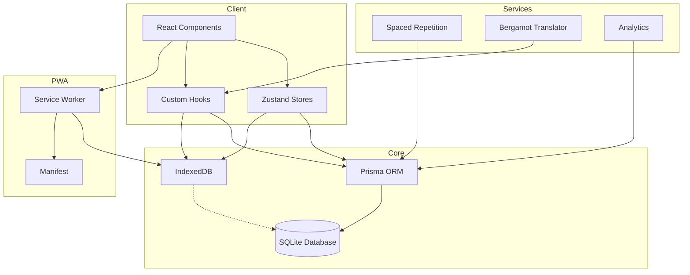

# ChunksWeb - English Fluency Learning Platform

## Architecture Plan

---

## 1. Project Overview

**Project Name:** ChunksWeb  
**Type:** Offline-first Progressive Web Application (PWA)  
**Core Functionality:** English fluency development through chunk-based acquisition, structured grammar progression, and scientifically optimized spaced repetition review.  
**Target Users:** English language learners seeking natural fluency through pattern recognition and active production.  
**Database:** Existing SQLite database (`chunks_v1.db`) as the single source of truth.

---

## 2. Technology Stack

| Layer           | Technology               | Version      |
| --------------- | ------------------------ | ------------ |
| Framework       | Next.js                  | Latest (14+) |
| Language        | TypeScript               | 5.x          |
| UI Library      | React                    | 18.x         |
| Styling         | Tailwind CSS             | 3.x          |
| Database        | SQLite                   | 3.x          |
| ORM             | Prisma                   | 5.x          |
| Offline Storage | IndexedDB (via Dexie.js) | 3.x          |
| Service Worker  | Workbox                  | 6.x          |
| Translation     | Bergamot (WASM)          | -            |
| Icons           | Lucide React             | -            |
| PWA             | next-pwa                 | -            |

---

## 3. Application Structure

```
src/
├── app/                          # Next.js App Router
│   ├── (auth)/                   # Authentication routes (future)
│   ├── (main)/                   # Main application routes
│   │   ├── layout.tsx            # Main layout with sidebar
│   │   ├── page.tsx              # Dashboard/Home
│   │   ├── browse/               # Chunk browser
│   │   │   └── page.tsx
│   │   ├── study/                # Study modes
│   │   │   ├── page.tsx          # Study selection
│   │   │   ├── free/page.tsx
│   │   │   ├── review/page.tsx
│   │   │   ├── feynman/page.tsx
│   │   │   ├── category/[id]/page.tsx
│   │   │   └── weakness/page.tsx
│   │   ├── chunk/[id]/page.tsx   # Chunk detail view
│   │   ├── progress/page.tsx     # Analytics dashboard
│   │   ├── search/page.tsx       # Search results
│   │   └── settings/page.tsx     # App settings
│   ├── globals.css
│   └── layout.tsx                # Root layout
├── components/
│   ├── ui/                       # Base UI components
│   │   ├── Button.tsx
│   │   ├── Card.tsx
│   │   ├── Input.tsx
│   │   ├── Select.tsx
│   │   ├── Badge.tsx
│   │   ├── Progress.tsx
│   │   ├── Modal.tsx
│   │   └── ...
│   ├── layout/                   # Layout components
│   │   ├── Sidebar.tsx
│   │   ├── Header.tsx
│   │   ├── MobileNav.tsx
│   │   └── Footer.tsx
│   ├── chunks/                   # Chunk-related components
│   │   ├── ChunkCard.tsx
│   │   ├── ChunkDetail.tsx
│   │   ├── ChunkList.tsx
│   │   ├── ChunkSearch.tsx
│   │   └── ChunkFilter.tsx
│   ├── study/                    # Study mode components
│   │   ├── StudyCard.tsx
│   │   ├── ReviewSession.tsx
│   │   ├── FeynmanMode.tsx
│   │   ├── ClozeExercise.tsx
│   │   ├── ReconstructionExercise.tsx
│   │   ├── TranslationExercise.tsx
│   │   ├── PatternMatchExercise.tsx
│   │   └── SpeakingPractice.tsx
│   ├── progress/                 # Progress components
│   │   ├── StreakDisplay.tsx
│   │   ├── MasteryChart.tsx
│   │   ├── RetentionMetrics.tsx
│   │   ├── ReviewForecast.tsx
│   │   └── Heatmap.tsx
│   └── providers/                # Context providers
│       ├── ThemeProvider.tsx
│       ├── ProgressProvider.tsx
│       └── TranslationProvider.tsx
├── lib/
│   ├── db/                       # Database layer
│   │   ├── prisma.ts             # Prisma client singleton
│   │   ├── schema.prisma         # Prisma schema
│   │   └── queries/              # Query functions
│   │       ├── chunks.ts
│   │       ├── categories.ts
│   │       ├── progress.ts
│   │       ├── review.ts
│   │       └── analytics.ts
│   ├── offline/                  # Offline utilities
│   │   ├── indexeddb.ts           # Dexie.js setup
│   │   ├── sync.ts               # Sync utilities
│   │   └── cache.ts              # Cache management
│   ├── spaced-repetition/        # SR algorithm
│   │   ├── sm2.ts                # SM-2 algorithm
│   │   ├── scheduler.ts          # Review scheduler
│   │   └── due-items.ts          # Due item queries
│   ├── translation/              # Translation utilities
│   │   ├── bergamot.ts           # Bergamot WASM wrapper
│   │   ├── translation-cache.ts  # Translation caching
│   │   └── translations.ts       # Translation functions
│   ├── analytics/                # Analytics utilities
│   │   ├── metrics.ts
│   │   ├── streaks.ts
│   │   └── forecasting.ts
│   └── utils/                    # General utilities
│       ├── cn.ts                 # Class name utility
│       ├── storage.ts            # LocalStorage helpers
│       └── keyboard.ts           # Keyboard shortcuts
├── hooks/                        # Custom React hooks
│   ├── useChunks.ts
│   ├── useProgress.ts
│   ├── useReview.ts
│   ├── useFeynman.ts
│   ├── useOffline.ts
│   ├── useKeyboard.ts
│   └── useTranslation.ts
├── stores/                       # State management (Zustand)
│   ├── progressStore.ts
│   ├── studyStore.ts
│   ├── settingsStore.ts
│   └── uiStore.ts
├── types/                        # TypeScript types
│   ├── chunk.ts
│   ├── category.ts
│   ├── study.ts
│   ├── progress.ts
│   └── index.ts
└── styles/                       # Additional styles
    └── fonts.ts

public/
├── manifest.json                 # PWA manifest
├── sw.js                         # Service worker (generated)
├── icons/                        # PWA icons
│   ├── icon-192.png
│   └── icon-512.png
└── fonts/                        # Offline fonts
```

---

## 4. Database Schema (Prisma Models)

Based on the requirements for Categories, Domains, Chunks, Structures, Examples, Variations, Tags, Review History, Mastery Tracking, User Notes, Favorites, Learning Sessions, and Progress Analytics, the following Prisma schema will be used:

```prisma
generator client {
  provider = "prisma-client-js"
}

datasource db {
  provider = "sqlite"
  url      = "file:./chunks_v1.db"
}

model Category {
  id          String   @id @default(cuid())
  name        String
  description String?
  level       String   // "foundation" | "basic" | "advanced"
  order       Int
  createdAt   DateTime @default(now())
  updatedAt   DateTime @updatedAt

  chunks      Chunk[]
  domains     Domain[]
}

model Domain {
  id          String   @id @default(cuid())
  name        String
  description String?
  categoryId  String
  category    Category @relation(fields: [categoryId], references: [id])

  chunks      Chunk[]
}

model Chunk {
  id            String   @id @default(cuid())
  chunk         String
  meaning       String
  explanation   String?
  pronunciation String?
  audioUrl      String?
  frequency     Int      @default(0)
  constructionType String? // "collocation" | "idiom" | "phrase" | "pattern"
  createdAt     DateTime @default(now())
  updatedAt     DateTime @updatedAt

  categoryId    String
  category      Category @relation(fields: [categoryId], references: [id])
  domainId      String?
  domain        Domain?  @relation(fields: [domainId], references: [id])

  examples      Example[]
  variations    Variation[]
  tags          ChunkTag[]
  structures    Structure[]

  // User-specific data
  masteries     Mastery[]
  reviews       Review[]
  notes         Note[]
  favorites     Favorite[]
  sessions      StudySession[]
}

model Example {
  id          String   @id @default(cuid())
  sentence    String
  translation String?
  order       Int      @default(0)
  chunkId     String
  chunk       Chunk    @relation(fields: [chunkId], references: [id], onDelete: Cascade)

  createdAt   DateTime @default(now())
  updatedAt   DateTime @updatedAt
}

model Variation {
  id        String   @id @default(cuid())
  variation String
  meaning   String?
  chunkId   String
  chunk     Chunk    @relation(fields: [chunkId], references: [id], onDelete: Cascade)

  createdAt DateTime @default(now())
  updatedAt DateTime @updatedAt
}

model Structure {
  id          String   @id @default(cuid())
  pattern     String
  explanation String?
  chunkId     String
  chunk       Chunk    @relation(fields: [chunkId], references: [id], onDelete: Cascade)

  createdAt   DateTime @default(now())
  updatedAt   DateTime @updatedAt
}

model Tag {
  id        String     @id @default(cuid())
  name      String     @unique
  chunks   ChunkTag[]

  createdAt DateTime  @default(now())
  updatedAt DateTime  @updatedAt
}

model ChunkTag {
  chunkId   String
  tagId     String
  chunk     Chunk   @relation(fields: [chunkId], references: [id], onDelete: Cascade)
  tag       Tag     @relation(fields: [tagId], references: [id], onDelete: Cascade)

  @@id([chunkId, tagId])
}

// User Progress Models

model Mastery {
  id            String   @id @default(cuid())
  chunkId       String   @unique
  chunk         Chunk    @relation(fields: [chunkId], references: [id], onDelete: Cascade)

  level         Int      @default(0) // 0-5 SM-2 level
  easeFactor    Float    @default(2.5)
  interval      Int      @default(0) // days
  repetitions   Int      @default(0)

  lastReviewed  DateTime?
  nextReview    DateTime?
  lastScore     Int?     // 0-5

  createdAt     DateTime @default(now())
  updatedAt     DateTime @updatedAt
}

model Review {
  id          String   @id @default(cuid())
  chunkId     String
  chunk       Chunk    @relation(fields: [chunkId], references: [id], onDelete: Cascade)

  score       Int      // 0-5
  responseTime Int?    // milliseconds
  reviewedAt  DateTime @default(now())

  // Optional: store the question/response for analysis
  questionType String? // "recall" | "cloze" | "translation" | "reconstruction"
}

model Note {
  id        String   @id @default(cuid())
  content   String
  chunkId   String
  chunk     Chunk    @relation(fields: [chunkId], references: [id], onDelete: Cascade)

  createdAt DateTime @default(now())
  updatedAt DateTime @updatedAt
}

model Favorite {
  id        String   @id @default(cuid())
  chunkId   String   @unique
  chunk     Chunk    @relation(fields: [chunkId], references: [id], onDelete: Cascade)

  createdAt DateTime @default(now())
}

model StudySession {
  id            String   @id @default(cuid())
  chunkId       String
  chunk         Chunk    @relation(fields: [chunkId], references: [id], onDelete: Cascade)

  mode          String   // "free" | "review" | "feynman" | "category" | "weakness"
  startedAt     DateTime @default(now())
  completedAt   DateTime?
  duration      Int?     // seconds

  exercises     Json?    // Array of exercise results
}

// Daily aggregate for analytics
model Translation {
  id            String   @id @default(cuid())
  sourceText    String
  sourceLang    String   // "en"
  targetLang    String   // "pt"
  translatedText String
  contentType   String   // "chunk" | "meaning" | "example" | "explanation" | "note" | "variation"
  contentId     String?  // Reference to the original content ID

  createdAt     DateTime @default(now())
  updatedAt     DateTime @updatedAt

  @@unique([sourceText, sourceLang, targetLang, contentType])
}

model DailyProgress {
  id            String   @id @default(cuid())
  date          String   @unique // YYYY-MM-DD

  chunksStudied Int      @default(0)
  chunksLearned Int      @default(0)
  reviewsDone   Int      @default(0)
  accuracy      Float    @default(0)
  totalTime     Int      @default(0) // seconds

  streak        Int      @default(0)

  createdAt     DateTime @default(now())
  updatedAt     DateTime @updatedAt
}
```

---

## 5. Offline-First Architecture

### 5.1 Data Flow

```
┌─────────────────────────────────────────────────────────────┐
│                     React Components                         │
└─────────────────────────────────────────────────────────────┘
                              │
                              ▼
┌─────────────────────────────────────────────────────────────┐
│                    Zustand Stores                            │
│  (progressStore, studyStore, settingsStore, uiStore)        │
└─────────────────────────────────────────────────────────────┘
                              │
                              ▼
┌─────────────────────────────────────────────────────────────┐
│                   Custom Hooks Layer                         │
│     useChunks, useProgress, useReview, useFeynman          │
└─────────────────────────────────────────────────────────────┘
                              │
              ┌───────────────┴───────────────┐
              ▼                               ▼
┌─────────────────────────┐     ┌─────────────────────────────┐
│     Online Mode         │     │      Offline Mode            │
│   (Prisma + SQLite)     │     │   (Dexie.js + IndexedDB)     │
└─────────────────────────┘     └─────────────────────────────┘
              │                               │
              ▼                               ▼
┌─────────────────────────┐     ┌─────────────────────────────┐
│   Production Database   │     │     Cached Data             │
│     chunks_v1.db        │     │   (SQLite backup in IDB)    │
└─────────────────────────┘     └─────────────────────────────┘
```

### 5.2 IndexedDB Schema (Dexie.js)

```typescript
// lib/offline/indexeddb.ts
import Dexie from 'dexie';

export class ChunksDatabase extends Dexie {
  chunks!: Dexie.Table<ChunkDTO, string>;
  categories!: Dexie.Table<CategoryDTO, string>;
  masteries!: Dexie.Table<MasteryDTO, string>;
  reviews!: Dexie.Table<ReviewDTO, string>;
  sessions!: Dexie.Table<SessionDTO, string>;
  dailyProgress!: Dexie.Table<DailyProgressDTO, string>;
  favorites!: Dexie.Table<FavoriteDTO, string>;
  notes!: Dexie.Table<NoteDTO, string>;

  constructor() {
    super('ChunksWeb');
    this.version(1).stores({
      chunks: 'id, categoryId, domainId, constructionType, frequency',
      categories: 'id, level, order',
      masteries: 'id, chunkId, nextReview',
      reviews: 'id, chunkId, reviewedAt',
      sessions: 'id, chunkId, mode, startedAt',
      dailyProgress: 'id, date',
      favorites: 'id, chunkId',
      notes: 'id, chunkId',
    });
  }
}
```

### 5.3 Service Worker Strategy

- **Precaching:** App shell, fonts, icons
- **Runtime caching:** Database queries cached with stale-while-revalidate
- **Background sync:** Queue study actions when offline, sync when online

---

## 6. Core Features Implementation

### 6.1 Spaced Repetition System (SM-2)

```typescript
// lib/spaced-repetition/sm2.ts
interface SM2Input {
  quality: number; // 0-5
  repetitions: number;
  easeFactor: number;
  interval: number;
}

interface SM2Output {
  repetitions: number;
  easeFactor: number;
  interval: number;
  nextReview: Date;
}

export function calculateSM2(input: SM2Input): SM2Output {
  let { quality, repetitions, easeFactor, interval } = input;

  if (quality >= 3) {
    // Correct response
    if (repetitions === 0) {
      interval = 1;
    } else if (repetitions === 1) {
      interval = 6;
    } else {
      interval = Math.round(interval * easeFactor);
    }
    repetitions += 1;
  } else {
    // Incorrect response
    repetitions = 0;
    interval = 1;
  }

  // Update ease factor
  easeFactor = easeFactor + (0.1 - (5 - quality) * (0.08 + (5 - quality) * 0.02));
  if (easeFactor < 1.3) easeFactor = 1.3;

  const nextReview = new Date();
  nextReview.setDate(nextReview.getDate() + interval);

  return { repetitions, easeFactor, interval, nextReview };
}
```

### 6.2 Study Modes

| Mode              | Description                   | Algorithm              |
| ----------------- | ----------------------------- | ---------------------- |
| Free Exploration  | Browse and learn at will      | None                   |
| Daily Recommended | System-selected optimal items | Custom priority queue  |
| Spaced Repetition | Review due items              | SM-2                   |
| Category Focus    | Deep dive into one category   | Round-robin            |
| Feynman Mode      | Explain-to-learn              | Custom guidance flow   |
| Speaking Practice | Pronunciation drills          | Audio recording + ML   |
| Writing Practice  | Production exercises          | Cloze + reconstruction |
| Exam Mode         | Timed assessment              | Random sampling        |
| Weakness Targeted | Items with low retention      | Low mastery first      |

### 6.3 Feynman Mode Flow

```
┌──────────────────┐
│  Present Chunk   │
│  (chunk + meaning)│
└──────────────────┘
         │
         ▼
┌──────────────────┐
│  "Explain in     │
│   your own words"│
└──────────────────┘
         │
         ▼
┌──────────────────┐
│  Accept Response │
│  (text or voice) │
└──────────────────┘
         │
         ▼
┌──────────────────┐
│  Analyze Gaps    │
│  - Key concepts  │
│  - Missing parts  │
│  - Misconceptions│
└──────────────────┘
         │
         ▼
┌──────────────────┐
│  Provide         │
│  Corrective      │
│  Feedback        │
└──────────────────┘
         │
         ▼
┌──────────────────┐
│  Reinforce       │
│  Understanding   │
└──────────────────┘
         │
         ▼
┌──────────────────┐
│  Update Mastery  │
│  (mark as known) │
└──────────────────┘
```

### 6.4 Exercise Types

1. **Active Recall:** Show meaning, recall the chunk
2. **Cloze Deletion:** Fill in the missing word(s)
3. **Sentence Reconstruction:** Rearrange scrambled words
4. **Translation Drills:** Translate between languages
5. **Reverse Translation:** Translate your own sentence
6. **Pattern Matching:** Identify the grammatical pattern
7. **Guided Production:** Use the chunk in a sentence

---

## 7. Translation Integration

### 7.1 Bergamot Translator (WebAssembly)

Bergamot is a client-side neural machine translation engine that runs entirely in the browser using WebAssembly. No API keys, no server dependency, fully offline after model download.

**Key Features:**

- Fully client-side execution
- No API keys or paid services required
- Privacy-friendly (no data leaves the device)
- Offline-capable after initial model download
- Supports English ↔ Portuguese (primary)

```typescript
// lib/translation/bergamot.ts
import { Translator, LanguagePair, Queue } from '@bergamot/translation';
import { getCachedTranslation, saveTranslation } from './storage';

interface TranslationCache {
  sourceText: string;
  sourceLang: string;
  targetLang: string;
  translation: string;
  timestamp: number;
}

class BergamotTranslator {
  private translator: Translator | null = null;
  private queue: Queue | null = null;
  private cache: Map<string, string> = new Map();
  private modelDownloading: boolean = false;

  // Translation direction
  private sourceLang = 'en';
  private targetLang = 'pt';

  async init(): Promise<void> {
    if (this.translator) return;

    this.modelDownloading = true;
    try {
      // Load the WASM module and model
      const response = await fetch('/models/bergamot');
      const modelBuffer = await response.arrayBuffer();

      this.translator = await Translator.fromBuffer(modelBuffer);
      this.queue = new Queue(this.translator);
    } finally {
      this.modelDownloading = false;
    }
  }

  private getCacheKey(text: string, source: string, target: string): string {
    return `${source}:${target}:${text}`;
  }

  async translate(
    text: string,
    contentType: 'chunk' | 'meaning' | 'example' | 'explanation' | 'note' | 'variation' = 'chunk',
    contentId?: string,
  ): Promise<string> {
    const cacheKey = this.getCacheKey(text, this.sourceLang, this.targetLang);

    // Check in-memory cache first
    if (this.cache.has(cacheKey)) {
      return this.cache.get(cacheKey)!;
    }

    // Check SQLite cache
    const cached = await getCachedTranslation(text, this.sourceLang, this.targetLang, contentType);
    if (cached) {
      this.cache.set(cacheKey, cached);
      return cached;
    }

    // Initialize translator if needed
    if (!this.translator) {
      await this.init();
    }

    // Perform translation
    const result = await this.queue!.translate(text, this.sourceLang, this.targetLang);
    const translation = result.text;

    // Store in memory cache
    this.cache.set(cacheKey, translation);

    // Save to SQLite for persistence
    await saveTranslation(
      text,
      translation,
      this.sourceLang,
      this.targetLang,
      contentType,
      contentId,
    );

    return translation;
  }

  async translateBatch(
    texts: string[],
    contentType: 'chunk' | 'meaning' | 'example' | 'explanation' | 'note' | 'variation' = 'chunk',
  ): Promise<string[]> {
    // Translate multiple texts efficiently
    const results = await Promise.all(texts.map((t) => this.translate(t, contentType)));
    return results;
  }

  isModelDownloading(): boolean {
    return this.modelDownloading;
  }

  isReady(): boolean {
    return this.translator !== null;
  }
}

// Singleton instance
export const bergamot = new BergamotTranslator();
```

### 7.2 Translation Storage (SQLite)

All translations are stored in the SQLite database using the `Translation` model.

```typescript
// lib/translation/storage.ts
import { prisma } from '@/lib/db/prisma';

interface TranslateOptions {
  sourceText: string;
  sourceLang?: string;
  targetLang?: string;
  contentType: 'chunk' | 'meaning' | 'example' | 'explanation' | 'note' | 'variation';
  contentId?: string;
}

export async function getCachedTranslation(
  sourceText: string,
  sourceLang: string,
  targetLang: string,
  contentType: string,
): Promise<string | null> {
  const translation = await prisma.translation.findUnique({
    where: {
      sourceText_sourceLang_targetLang_contentType: {
        sourceText,
        sourceLang,
        targetLang,
        contentType,
      },
    },
  });
  return translation?.translatedText ?? null;
}

export async function saveTranslation(
  sourceText: string,
  translatedText: string,
  sourceLang: string,
  targetLang: string,
  contentType: string,
  contentId?: string,
): Promise<void> {
  await prisma.translation.upsert({
    where: {
      sourceText_sourceLang_targetLang_contentType: {
        sourceText,
        sourceLang,
        targetLang,
        contentType,
      },
    },
    update: {
      translatedText,
      updatedAt: new Date(),
    },
    create: {
      sourceText,
      translatedText,
      sourceLang,
      targetLang,
      contentType,
      contentId,
    },
  });
}

export async function clearTranslationCache(): Promise<void> {
  await prisma.translation.deleteMany();
}
```

### 7.3 Supported Translation Directions

| Source       | Target          | Use Case                      |
| ------------ | --------------- | ----------------------------- |
| English (en) | Portuguese (pt) | Primary translation direction |

**Translation Targets:**

- Chunk meanings
- Example sentences
- Explanations
- User notes
- Related expressions

---

## 8. Search & Filtering

### 8.1 Filter Options

| Filter         | Type         | Source                                        |
| -------------- | ------------ | --------------------------------------------- |
| Keyword        | Text search  | chunk.chunk, chunk.meaning, chunk.explanation |
| Level          | Multi-select | category.level                                |
| Category       | Multi-select | chunk.categoryId                              |
| Domain         | Multi-select | chunk.domainId                                |
| Frequency      | Range        | chunk.frequency                               |
| Construction   | Multi-select | chunk.constructionType                        |
| Mastery Status | Range        | mastery.level                                 |
| Favorites      | Boolean      | favorites                                     |
| Review Due     | Date range   | mastery.nextReview                            |

### 8.2 Search Algorithm

1. Full-text search on chunk, meaning, explanation
2. Weighted scoring: exact match > partial match
3. Boost by frequency and mastery needs
4. Include related variations and examples in results

---

## 9. Analytics & Progress

### 9.1 Tracked Metrics

| Metric               | Description             | Storage                          |
| -------------------- | ----------------------- | -------------------------------- |
| Daily Streak         | Consecutive study days  | DailyProgress.streak             |
| Retention Rate       | % correct over time     | DailyProgress.accuracy           |
| Mastery Distribution | Chunks by mastery level | Computed from Mastery table      |
| Review Load          | Due items forecast      | Computed from Mastery.nextReview |
| Time on Task         | Study duration          | DailyProgress.totalTime          |
| Category Completion  | % of category mastered  | Computed                         |
| Heatmap              | Activity calendar       | DailyProgress aggregated         |

### 9.2 Forecast Algorithm

```typescript
// lib/analytics/forecasting.ts
export function forecastReviewLoad(masteries: Mastery[], days: number): Map<string, number> {
  const forecast = new Map<string, number>();
  const now = new Date();

  for (let i = 0; i < days; i++) {
    const date = new Date(now);
    date.setDate(date.getDate() + i);
    const key = date.toISOString().split('T')[0];

    const dueCount = masteries.filter((m) => {
      if (!m.nextReview) return i === 0;
      const reviewDate = new Date(m.nextReview);
      return reviewDate.toISOString().split('T')[0] === key;
    }).length;

    forecast.set(key, dueCount);
  }

  return forecast;
}
```

---

## 10. UI/UX Design

### 10.1 Design System

- **Colors:** Neutral palette with accent colors per level
  - Foundation: Blue (#3B82F6)
  - Basic: Green (#22C55E)
  - Advanced: Purple (#A855F7)
- **Typography:** Inter for UI, Merriweather for reading
- **Spacing:** 4px base unit, 8/16/24/32/48 scale
- **Border Radius:** 8px default, 12px for cards, 16px for modals
- **Shadows:** Subtle, layered for depth

### 10.2 Color Palette

```css
:root {
  --background: #fafafa;
  --foreground: #171717;
  --card: #ffffff;
  --card-foreground: #171717;
  --primary: #3b82f6;
  --primary-foreground: #ffffff;
  --secondary: #f5f5f5;
  --secondary-foreground: #171717;
  --muted: #f5f5f5;
  --muted-foreground: #737373;
  --accent: #f5f5f5;
  --accent-foreground: #171717;
  --destructive: #ef4444;
  --destructive-foreground: #ffffff;
  --border: #e5e5e5;
  --ring: #3b82f6;

  /* Level Colors */
  --foundation: #3b82f6;
  --basic: #22c55e;
  --advanced: #a855f7;
}

.dark {
  --background: #0a0a0a;
  --foreground: #fafafa;
  --card: #171717;
  --card-foreground: #fafafa;
  --primary: #3b82f6;
  --primary-foreground: #ffffff;
  --secondary: #262626;
  --secondary-foreground: #fafafa;
  --muted: #262626;
  --muted-foreground: #a3a3a3;
  --accent: #262626;
  --accent-foreground: #fafafa;
  --destructive: #ef4444;
  --destructive-foreground: #ffffff;
  --border: #262626;
  --ring: #3b82f6;
}
```

### 10.3 Layout Structure

```
┌─────────────────────────────────────────────────────────────┐
│  Header (logo, search, theme toggle, settings)              │
├────────────┬──────────────────────────────────────────────────┤
│            │                                                  │
│  Sidebar   │           Main Content Area                      │
│  (nav,     │                                                  │
│  categories│           - Dashboard                            │
│  stats)    │           - Study Interface                     │
│            │           - Browse/Search                        │
│            │           - Progress                            │
│            │                                                  │
├────────────┴──────────────────────────────────────────────────┤
│  Mobile: Bottom Navigation Bar                               │
└─────────────────────────────────────────────────────────────┘
```

### 10.4 Keyboard Shortcuts

| Shortcut | Action                      |
| -------- | --------------------------- |
| `Space`  | Flip card / Next            |
| `1-5`    | Rate difficulty (in review) |
| `S`      | Toggle shuffle              |
| `F`      | Add to favorites            |
| `N`      | Add note                    |
| `Esc`    | Close modal/exit            |
| `/`      | Focus search                |
| `?`      | Show shortcuts              |

---

## 11. PWA Configuration

### 11.1 Manifest

```json
{
  "name": "ChunksWeb",
  "short_name": "Chunks",
  "description": "English fluency through chunk-based learning",
  "start_url": "/",
  "display": "standalone",
  "background_color": "#0A0A0A",
  "theme_color": "#3B82F6",
  "icons": [
    { "src": "/icons/icon-192.png", "sizes": "192x192", "type": "image/png" },
    { "src": "/icons/icon-512.png", "sizes": "512x512", "type": "image/png" }
  ]
}
```

### 11.2 Service Worker Caching

- **App Shell:** Cache on install
- **Database:** Replicate to IndexedDB on first load
- **Fonts:** Cache with expiration
- **API calls:** Network-first with cache fallback

---

## 12. API Routes (Next.js)

For any future server-side operations:

| Route              | Method   | Description        |
| ------------------ | -------- | ------------------ |
| `/api/chunks`      | GET      | List/search chunks |
| `/api/chunks/[id]` | GET      | Get chunk details  |
| `/api/categories`  | GET      | List categories    |
| `/api/progress`    | GET/POST | User progress      |
| `/api/review`      | POST     | Submit review      |
| `/api/analytics`   | GET      | Analytics data     |
| `/api/sync`        | POST     | Sync offline data  |

---

## 13. Project Phases

### Phase 1: Foundation

1. Initialize Next.js project with TypeScript
2. Configure Prisma with existing database
3. Set up Tailwind CSS with design system
4. Create base UI components
5. Implement layout (sidebar, header, mobile nav)

### Phase 2: Core Features

1. Chunk browser and search
2. Chunk detail view
3. Category/domain navigation
4. Basic study mode (card flip)

### Phase 3: Learning System

1. Spaced repetition algorithm
2. Review session with SM-2
3. Exercise types (cloze, reconstruction, translation)
4. Feynman mode

### Phase 4: Progress & Analytics

1. Progress tracking
2. Daily streaks
3. Mastery charts
4. Review forecasting
5. Heatmap visualization

### Phase 5: Offline & PWA

1. IndexedDB setup with Dexie
2. Service worker configuration
3. PWA manifest and icons
4. Offline sync logic

### Phase 6: Polish

1. Keyboard shortcuts
2. Dark mode refinement
3. Mobile optimization
4. Performance optimization
5. Translation integration

---

## 14. File Structure for Implementation

```
chunks-web/                    # Next.js project root
├── prisma/
│   └── schema.prisma          # Database schema
├── public/
│   ├── manifest.json
│   └── icons/
├── src/
│   ├── app/
│   ├── components/
│   ├── lib/
│   ├── hooks/
│   ├── stores/
│   └── types/
├── package.json
├── tailwind.config.ts
├── next.config.js
└── tsconfig.json
```

---

## 15. Dependencies

```json
{
  "dependencies": {
    "next": "^14.0.0",
    "react": "^18.2.0",
    "react-dom": "^18.2.0",
    "@prisma/client": "^5.0.0",
    "dexie": "^3.2.0",
    "zustand": "^4.4.0",
    "lucide-react": "^0.294.0",
    "clsx": "^2.0.0",
    "tailwind-merge": "^2.0.0",
    "date-fns": "^2.30.0",
    "next-pwa": "^5.6.0",
    "@bergamot-translation/client": "^1.0.0"
  },
  "devDependencies": {
    "typescript": "^5.0.0",
    "prisma": "^5.0.0",
    "tailwindcss": "^3.3.0",
    "@types/react": "^18.2.0",
    "@types/node": "^20.0.0"
  }
}
```

---

## 16. Mermaid Diagram: Architecture Overview



---

## 17. Implementation Checklist

### Initialization

- [ ] Create Next.js project with TypeScript
- [ ] Configure Tailwind CSS
- [ ] Set up Prisma with existing SQLite database
- [ ] Generate Prisma client
- [ ] Configure next-pwa

### Database Layer

- [ ] Define Prisma schema
- [ ] Create query functions for chunks
- [ ] Create query functions for categories
- [ ] Create query functions for progress
- [ ] Create query functions for review/SM-2
- [ ] Create query functions for analytics

### UI Components

- [ ] Base components (Button, Card, Input, etc.)
- [ ] Layout components (Sidebar, Header, MobileNav)
- [ ] Theme provider with dark mode
- [ ] Chunk components (Card, List, Detail, Search)

### Core Features

- [ ] Home/Dashboard page
- [ ] Chunk browser page
- [ ] Chunk detail page
- [ ] Category pages
- [ ] Search functionality
- [ ] Filter system

### Study Modes

- [ ] Card flip interface
- [ ] Review session with SM-2
- [ ] Cloze exercise
- [ ] Reconstruction exercise
- [ ] Translation exercise
- [ ] Feynman mode
- [ ] Speaking practice (future)

### Progress & Analytics

- [ ] Progress tracking store
- [ ] Streak calculation
- [ ] Mastery distribution chart
- [ ] Review forecast
- [ ] Heatmap component
- [ ] Progress dashboard

### Offline & PWA

- [ ] IndexedDB setup
- [ ] Service worker configuration
- [ ] PWA manifest
- [ ] Offline sync
- [ ] Install prompt

### Polish

- [ ] Keyboard shortcuts
- [ ] Responsive design
- [ ] Animations
- [ ] Error boundaries
- [ ] Loading states

---

## 18. Next Steps

1. **Approve this plan** - Review the architecture and provide feedback
2. **Switch to Code mode** - Begin implementation starting with Phase 1
3. **Iterate** - Refine as implementation reveals additional requirements

---

_Plan created for ChunksWeb - English Fluency Learning Platform_
