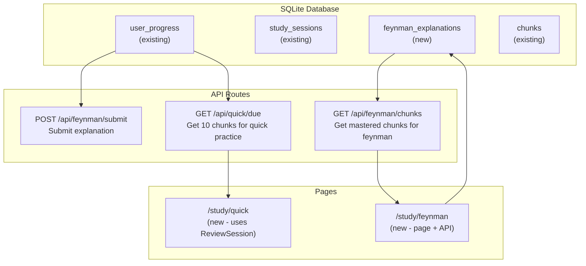

# Plan: Make Feynman Mode and Quick Practice Functional

## Context

After implementing core spaced repetition (Review Mode), we need to enable two additional study modes:

1. **Feynman Mode**: User explains mastered chunks in their own words (requires chunks with repetitions >= 3)
2. **Quick Practice**: Short 5-10 minute review sessions for keeping memory fresh

## Current State

### Feynman Mode

- [`FeynmanMode.tsx`](src/components/study/FeynmanMode.tsx:1) component exists with 4 steps: intro → explain → feedback → complete
- Links to `/study/feynman` but page doesn't exist
- Button disabled when `stats.mastered === 0`

### Quick Practice

- [`ReviewSession.tsx`](src/components/study/ReviewSession.tsx:1) component exists and can be reused
- Links to `/study/quick` but page doesn't exist
- Button disabled when `dueToday === 0`

## Architecture



## Database Schema

### New Table: feynman_explanations

Stores user explanations for Feynman Mode practice.

| Column      | Type                | Description                                          |
| ----------- | ------------------- | ---------------------------------------------------- |
| id          | INTEGER PRIMARY KEY | Auto-increment ID                                    |
| chunk_id    | INTEGER             | FK to chunks.id                                      |
| explanation | TEXT                | User's explanation text                              |
| quality     | INTEGER             | Self-assessed quality (1-3: needs work/good/perfect) |
| created_at  | INTEGER             | Unix timestamp                                       |

## Implementation Steps

### Step 1: Add Database Functions

- Add `initFeynmanTable()` function in [`sqlite.ts`](src/lib/db/sqlite.ts)
- Add `getMasteredChunks()` - get chunks with repetitions >= 3
- Add `saveFeynmanExplanation(chunkId, explanation, quality)`
- Add `getFeynmanChunksForStudy(limit)` - get chunks needing practice

### Step 2: Create API Routes

#### GET /api/feynman/chunks

Returns mastered chunks for Feynman practice.

```json
{
  "chunks": [
    {
      "id": "1",
      "chunk": "as far as I know",
      "meaning": "in my opinion",
      "examples": [...],
      "category": {...}
    }
  ],
  "count": 5
}
```

#### POST /api/feynman/submit

Saves user's explanation for a chunk.

```json
// Request
{ "chunkId": 1, "explanation": "I think this means...", "quality": 2 }

// Response
{ "success": true, "saved": true }
```

#### GET /api/quick/due

Returns up to 10 chunks for quick practice (sampled from due chunks or new).

```json
{
  "chunks": [...],
  "count": 8
}
```

### Step 3: Create /study/feynman Page

- Client component fetching mastered chunks
- Uses [`FeynmanMode`](src/components/study/FeynmanMode.tsx:25) component
- Each chunk: show chunk → user writes explanation → show feedback
- On complete, save explanation to database

### Step 4: Create /study/quick Page

- Client component
- Fetches 10 chunks via API
- Uses existing [`ReviewSession`](src/components/study/ReviewSession.tsx:25) component
- Shorter session (5-10 chunks), faster pace

## Files to Modify/Create

| File                                  | Action | Description                                        |
| ------------------------------------- | ------ | -------------------------------------------------- |
| `src/lib/db/sqlite.ts`                | Modify | Add feynman_explanations table and query functions |
| `src/app/api/feynman/chunks/route.ts` | Create | GET mastered chunks for feynman practice           |
| `src/app/api/feynman/submit/route.ts` | Create | POST user explanation                              |
| `src/app/api/quick/due/route.ts`      | Create | GET 10 chunks for quick practice                   |
| `src/app/study/feynman/page.tsx`      | Create | Feynman Mode study page                            |
| `src/app/study/quick/page.tsx`        | Create | Quick Practice study page                          |

## Test Plan

1. **Feynman Mode**:
   - Navigate to `/study/feynman` (requires mastered chunks)
   - See chunk and write explanation
   - Submit → explanation saved to database
   - Continue to next chunk or complete

2. **Quick Practice**:
   - Navigate to `/study/quick` (requires due chunks)
   - Review 10 chunks in quick succession
   - Complete → stats updated

## Priority

1. Quick Practice (reuses existing ReviewSession, simpler)
2. Feynman Mode (needs new page and explanation storage)

## Design Decisions

- Feynman explanations are stored separately (not affecting SM-2)
- Quality rating in Feynman is self-assessed, not algorithm-based
- Quick Practice uses same SM-2 flow as Review Mode, just different limits
