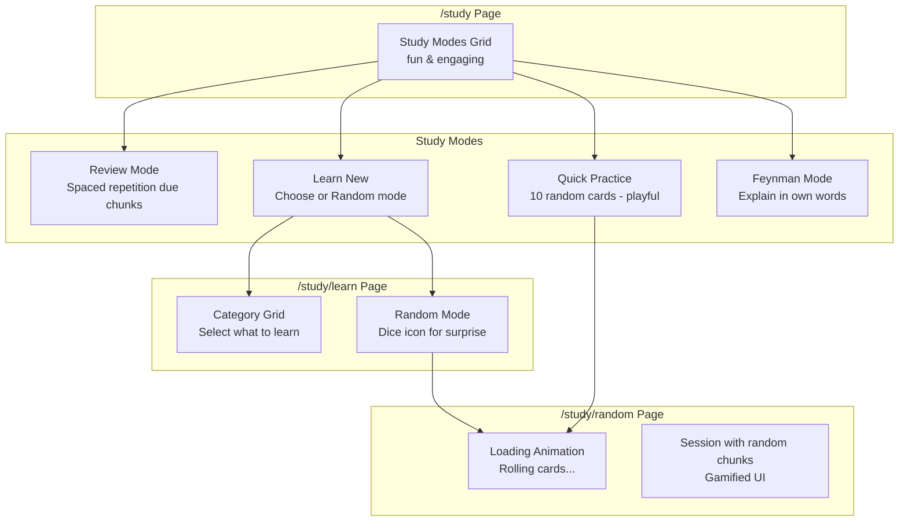

# Plan: Gamified Study System

## Context

The current study system is functional but not engaging. The user wants to make it more playful and game-like with random selection and interactive learning modes.

## Current State

- **Review Mode**: Uses spaced repetition (SM-2) - works well
- **Quick Practice**: Currently shows due chunks - needs to select 10 random cards
- **Learn New**: Links to /browse - needs a new dedicated screen with choice + random mode
- **Feynman Mode**: Works but needs explanation saving working properly

## New Architecture



## Key Changes

### 1. Quick Practice (Gamified)

- Instead of "due today" logic, it shows 10 random cards
- Add rolling/dice animation when starting
- Show "fire" streak indicator during session
- Fun celebration when complete

### 2. Learn New (New /study/learn Page)

- Shows category grid with chunk counts
- Each category card has: icon, name, color, chunk count, progress
- "Random Mode" button with dice icon
- Click category → shows chunk list to select from
- "Random Mode" → picks 10 random from all or selected category

### 3. Random Study Session (/study/random)

- Shows loading animation with rolling cards
- 10 cards selected randomly from chosen category or all
- Card flip animation, timer, streak counter
- Celebration screen on completion

### 4. UI Enhancements

- Animated card selection with confetti
- Progress bars with animations
- Streak fire emoji indicator
- Bouncy transitions
- Colorful category badges

## Implementation Steps

### Step 1: Modify /study Page - Make it Fun

Replace static cards with animated, game-like interface:

- Add dice/sparkle icons for random modes
- Show progress indicators
- Add hover animations
- Use color coding for availability

### Step 2: Create /study/learn Page

New page showing categories to learn from:

- Grid of category cards with colors
- Each shows: name, chunk count, icon, color
- "Random Mode" button at top
- Click category → /study/learn/[categoryId]

### Step 3: Create /study/random Page

The gamified random study session:

- Loading state with card roll animation
- 10 random chunks fetched from API
- Uses existing ReviewSession component
- Shows streak/flame counter during session
- Celebration animation on completion

### Step 4: API for Random Chunks

- GET /api/chunks/random?category=&limit=10
- Returns random chunks, optionally filtered by category

### Step 5: Fix Feynman Mode

- Ensure explanation submission works
- Show mastered chunks properly

## Files to Create/Modify

### New Files

| File                                        | Description             |
| ------------------------------------------- | ----------------------- |
| `src/app/study/learn/page.tsx`              | Category selection page |
| `src/app/study/learn/[categoryId]/page.tsx` | Chunks in category      |
| `src/app/study/random/page.tsx`             | Random study session    |
| `src/app/api/chunks/random/route.ts`        | Get random chunks       |

### Modified Files

| File                           | Changes                      |
| ------------------------------ | ---------------------------- |
| `src/app/study/page.tsx`       | Make it gamified, fun UI     |
| `src/app/study/quick/page.tsx` | Add animation, use random    |
| `src/lib/db/sqlite.ts`         | Add getRandomChunks function |

## Design Decisions

1. **Random Selection**: All random modes use Fisher-Yates shuffle for true randomness
2. **Gamification**: Fire emoji 🔥 for streaks, confetti for achievements
3. **Loading States**: Animated dice/cards rolling while loading
4. **Completion**: Celebration screen with stats summary
5. **Categories**: Visual cards with progress indicators

## API Changes

### GET /api/chunks/random

```typescript
// Request
GET /api/chunks/random?categoryId=1&limit=10

// Response
{
  "chunks": [...],
  "count": 10
}
```

### GET /api/learn/categories

```typescript
// Response
{
  "categories": [
    { "id": 1, "name": "Greetings", "color": "#607d8b", "chunkCount": 45, "learnedCount": 12 },
    ...
  ]
}
```

## Visual Elements

1. **Dice Icon**: 🎲 for random modes
2. **Fire Streak**: 🔥 streak counter during sessions
3. **Confetti**: 🎊 on completion
4. **Card Flip**: Animated card reveals
5. **Progress Bars**: Animated fill with percentages

## Test Plan

1. Click Quick Practice → See rolling animation → 10 random cards appear
2. Click Learn New → See category grid → Click category → See chunks
3. Click Random Mode in Learn New → Rolling animation → Random session
4. Complete session → Celebration screen with stats

## Priority Order

1. Create /api/chunks/random
2. Create /study/random page with animation
3. Create /study/learn page with category grid
4. Modify /study page to be more gamified
5. Add confetti/celebration animations
