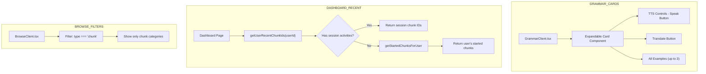

# Grammar Cards Enhancement & Browse Fixes Plan

## Overview

This plan addresses three issues:

1. **Grammar Cards**: Add translation, TTS buttons, and expand functionality to show all 3 examples
2. **Recent Chunks**: Make dashboard "recent chunks" reflect user's actual study history
3. **Browse Filters**: Fix core/basic category filtering in browse page

---

## Issue 1: Grammar Cards Enhancement

### Current State

- Grammar cards in `GrammarClient.tsx` show only 1 example per structure
- No translation button
- No TTS (text-to-speech) button
- No expand/collapse functionality
- Cards show `key_forms`, `essential_vocabulary`, `when_to_use` fields

### Desired State

- Each grammar card should expand to show ALL examples (up to 3)
- Add "Speak" button using TTS (same as `ReviewSession.tsx`)
- Add "Translate" button (same as existing translation in other components)
- Buttons should be at top of card (before config settings in future)
- User can only experience the feature in grammar page

### Implementation

**File:** `src/components/grammar/GrammarClient.tsx`

1. **Add State for Expand/Collapse per Card**

```typescript
const [expandedIds, setExpandedIds] = useState<Set<number>>(new Set());
```

2. **Add Translation & TTS Imports**

```typescript
import { translateText, isTranslationAvailable, SupportedLanguage } from '@/lib/translation';
import { useTTSPlaybackClient } from '@/lib/pronunciation/hooks/useTTSPlaybackClient';
import { TTSControls } from '@/lib/pronunciation/ui/TTSControls';
import { Volume2, Languages } from 'lucide-react';
```

3. **Add per-card state for translation**

```typescript
const [translatedPatterns, setTranslatedPatterns] = useState<Record<number, string>>({});
const [showTranslation, setShowTranslation] = useState<Record<number, boolean>>({});
```

4. **Transform card to include:**
   - Expandable section for all examples (fetch examples per structure via API)
   - "Speak" button using `useTTSPlaybackClient` with locale
   - "Translate" button for pattern/core_meaning
   - State management for show/hide translations

**Note:** Grammar structures are stored in `grammar_structures` table, not `chunks`. Need to:

- Create API endpoint `GET /api/grammar/structures/:id/examples`
- Or include examples in the existing `getGrammarStructures` response

**API Change:** `src/app/api/grammar/structures/route.ts` should support fetching examples for a structure ID.

### Grammar Structure Examples Issue

The current `grammar_structures` table does NOT have examples directly. Looking at DB schema, examples are linked via `examples` table with `item_type` and `item_id`.

For grammar, we'd need to query:

```sql
SELECT * FROM examples WHERE item_type = 'grammar' AND item_id = grammar_structure_id
```

**Solution:**

- Create `GET /api/grammar/structures/:id/examples` endpoint
- OR modify existing API to include examples when structure is returned

---

## Issue 2: Recent Chunks on Dashboard

### Current State

```typescript
// In src/app/page.tsx
async function getRecentChunks(): Promise<LocalChunk[]> {
  return getChunks(10, 0); // Returns first 10 chunks from DB, not user's history
}
```

### Desired State

- Show chunks the user has recently studied/practiced
- Use `session_activities` table to get chunk IDs from recent sessions
- Fallback to user's started chunks from `user_progress`

### Implementation

**File:** `src/lib/db/sqlite.ts`

1. **Add function to get user's recent chunk IDs from sessions**

```typescript
export function getUserRecentChunkIds(userId: number, limit = 10): number[] {
  // Get chunk IDs from recent session_activities
  const stmt = db.prepare(`
    SELECT chunk_ids FROM session_activities
    WHERE user_id = ?
    ORDER BY created_at DESC
    LIMIT 3
  `);
  const sessions = stmt.all(userId) as { chunk_ids: string }[];

  // Combine and dedupe chunk IDs from recent sessions
  const allIds = new Set<number>();
  for (const session of sessions) {
    try {
      const ids = JSON.parse(session.chunk_ids);
      ids.forEach((id: number) => allIds.add(id));
    } catch {}
  }

  return Array.from(allIds).slice(0, limit);
}
```

2. **Update `src/app/page.tsx`**

```typescript
async function getRecentChunks(userId: number): Promise<LocalChunk[]> {
  const recentIds = getUserRecentChunkIds(userId, 10);
  if (recentIds.length > 0) {
    return getChunksByIds(recentIds);
  }
  // Fallback: get user's started chunks
  return getStartedChunksForUser(userId, 10);
}
```

3. **Add `getStartedChunksForUser` function to sqlite.ts**

```typescript
export function getStartedChunksForUser(userId: number, limit = 10): Chunk[] {
  const stmt = db.prepare(`
    SELECT c.* FROM chunks c
    JOIN user_progress up ON c.id = up.chunk_id
    WHERE up.user_id = ? AND up.repetitions > 0
    ORDER BY up.updated_at DESC
    LIMIT ?
  `);
  return stmt.all(userId, limit) as Chunk[];
}
```

**Note:** Need authentication to get real userId. Dashboard currently uses DEFAULT_USER_ID=1.

---

## Issue 3: Browse Page Core/Basic Filters

### Current State

In `BrowseClient.tsx` lines 144-146:

```typescript
const filteredCategories = categories
  .filter((cat) => !cat.name.match(/^core architecture$/i))
  .filter((cat) => !cat.name.match(/^basic \d$/i));
```

This filters OUT "core architecture" and "basic X" categories from the dropdown.

### Problem

User says: "core and basic are not chunks, they are grammar categories. So you simply remove these filters since there's already a specific grammar page."

### Desired State

- Remove the manual filtering of core/basic categories
- But need to understand what the user actually wants filtered:
  - Option A: Remove filters entirely - show all categories
  - Option B: Only show chunk-type categories (type === 'chunk')

### Implementation

**File:** `src/components/browse/BrowseClient.tsx`

Change filtering logic:

```typescript
// Filter to only show chunk-type categories (not grammar/foundation)
const chunkCategories = categories.filter((cat) => cat.type === 'chunk');
```

Or simply remove the filter entirely if user wants to see all categories.

**Clarification needed:** The user says "you simply remove these filters because there's already a specific grammar page" - this suggests Option B (only chunk categories) since they want grammar to go to grammar page.

---

## Mermaid Architecture



---

## Files to Modify

| File                                       | Changes                                                    |
| ------------------------------------------ | ---------------------------------------------------------- |
| `src/components/grammar/GrammarClient.tsx` | Add TTS, translation, expand functionality                 |
| `src/app/api/grammar/structures/route.ts`  | Add examples endpoint or include examples                  |
| `src/lib/db/sqlite.ts`                     | Add `getUserRecentChunkIds()`, `getStartedChunksForUser()` |
| `src/app/page.tsx`                         | Update `getRecentChunks()` to use user context             |
| `src/components/browse/BrowseClient.tsx`   | Fix category filter to only show chunk types               |

---

## API Changes

### New: `GET /api/grammar/structures/:id/examples`

Returns examples for a specific grammar structure.

### Modified: `GET /api/grammar/structures`

Add optional `examples=true` query param to include examples in response.

---

## Testing Scenarios

1. **Grammar Cards**
   - Click to expand grammar card
   - See all 3 examples
   - Click "Speak" button - hear TTS
   - Click "Translate" button - see translation

2. **Recent Chunks**
   - Study some chunks via random/review
   - Go to dashboard
   - Verify recent chunks show recently studied, not just first 10

3. **Browse Filters**
   - Go to /browse
   - Verify core/basic categories don't appear in dropdown
   - Only chunk-type categories shown
