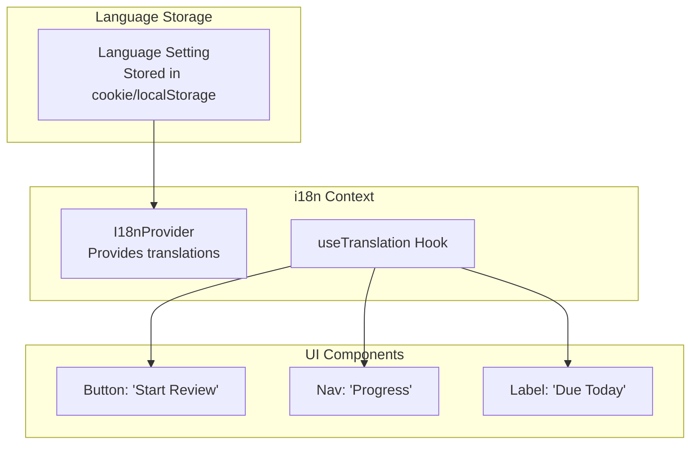

# Plan: UI Translation System (i18n)

## Context

Currently all UI text is hardcoded in English. Users should be able to select their preferred language for fixed UI elements (buttons, labels, navigation, etc.). Database content remains in its original language.

## Goal

- Allow users to select their preferred language for UI strings
- Support multiple languages (English, Portuguese, Spanish, etc.)
- Database content remains unchanged
- Easy to add new languages

## Supported Languages (Initial)

- English (en) - Default
- Portuguese (pt)
- Spanish (es)

## Architecture



## Implementation Steps

### Step 1: Create Translation Files

```
src/lib/i18n/
├── translations/
│   ├── en.json
│   ├── pt.json
│   └── es.json
├── i18n.ts
└── I18nProvider.tsx
```

### Step 2: Translation JSON Structure

```json
// en.json
{
  "nav": {
    "home": "Home",
    "browse": "Browse",
    "grammar": "Grammar",
    "study": "Study",
    "progress": "Progress",
    "settings": "Settings"
  },
  "buttons": {
    "startReview": "Start Review",
    "continue": "Continue",
    "submit": "Submit",
    "cancel": "Cancel",
    "back": "Back",
    "next": "Next"
  },
  "study": {
    "dueToday": "Due Today",
    "mastered": "Mastered",
    "streak": "Streak",
    "quickPractice": "Quick Practice",
    "learnNew": "Learn New",
    "review": "Review",
    "feynmanMode": "Feynman Mode"
  },
  "progress": {
    "yourProgress": "Your Progress",
    "totalChunks": "Total Chunks",
    "categories": "Categories"
  },
  "captcha": {
    "solveMath": "Solve to continue",
    "slideToUnlock": "Slide to unlock"
  },
  "auth": {
    "login": "Login",
    "register": "Register",
    "logout": "Logout",
    "welcomeBack": "Welcome Back",
    "createAccount": "Create Account"
  }
}
```

### Step 3: Create i18n Context

```tsx
// src/lib/i18n/I18nProvider.tsx
'use client';

import { createContext, useContext, useState, useEffect, ReactNode } from 'react';
import translations from './translations';

type Language = 'en' | 'pt' | 'es';

interface I18nContextType {
  language: Language;
  setLanguage: (lang: Language) => void;
  t: (key: string) => string;
}

const I18nContext = createContext<I18nContextType | null>(null);

export function I18nProvider({ children }: { children: ReactNode }) {
  const [language, setLanguage] = useState<Language>('en');

  useEffect(() => {
    const stored = localStorage.getItem('language') as Language;
    if (stored) setLanguage(stored);
  }, []);

  const t = (key: string): string => {
    const keys = key.split('.');
    let value: any = translations[language];
    for (const k of keys) {
      value = value?.[k];
    }
    return value || key;
  };

  return (
    <I18nContext.Provider value={{ language, setLanguage, t }}>{children}</I18nContext.Provider>
  );
}

export function useTranslation() {
  const context = useContext(I18nContext);
  if (!context) throw new Error('useTranslation must be used within I18nProvider');
  return context;
}
```

### Step 4: Add Language Selector

Add to Settings page or create a simple dropdown:

```tsx
// src/components/LanguageSelector.tsx
'use client';
import { useTranslation } from '@/lib/i18n/I18nProvider';

const languages = [
  { code: 'en', name: 'English' },
  { code: 'pt', name: 'Português' },
  { code: 'es', name: 'Español' },
];

export function LanguageSelector() {
  const { language, setLanguage } = useTranslation();

  return (
    <select
      value={language}
      onChange={(e) => setLanguage(e.target.value as Language)}
      className="px-3 py-2 border rounded-md"
    >
      {languages.map((lang) => (
        <option key={lang.code} value={lang.code}>
          {lang.name}
        </option>
      ))}
    </select>
  );
}
```

### Step 5: Update Layout

```tsx
// src/app/layout.tsx
import { I18nProvider } from '@/lib/i18n/I18nProvider';

export default function RootLayout({ children }) {
  return (
    <html lang="en">
      <body>
        <I18nProvider>
          <AuthProvider>
            <TopNav />
            <main>{children}</main>
          </AuthProvider>
        </I18nProvider>
      </body>
    </html>
  );
}
```

### Step 6: Update Components

Replace hardcoded strings with `t()` function:

```tsx
// Before
<Button>Start Review</Button>;

// After
const { t } = useTranslation();
<Button>{t('buttons.startReview')}</Button>;
```

## Files to Create

| File                                  | Description             |
| ------------------------------------- | ----------------------- |
| `src/lib/i18n/translations/en.json`   | English translations    |
| `src/lib/i18n/translations/pt.json`   | Portuguese translations |
| `src/lib/i18n/translations/es.json`   | Spanish translations    |
| `src/lib/i18n/I18nProvider.tsx`       | i18n context and hook   |
| `src/components/LanguageSelector.tsx` | Language dropdown       |

## Files to Modify

| File                               | Changes                    |
| ---------------------------------- | -------------------------- |
| `src/app/layout.tsx`               | Add I18nProvider           |
| `src/components/layout/TopNav.tsx` | Use t() for nav items      |
| `src/app/study/page.tsx`           | Use t() for study options  |
| `src/app/progress/page.tsx`        | Use t() for stats labels   |
| `src/components/ui/Button.tsx`     | Accept label prop, use t() |
| `src/app/login/page.tsx`           | Use t() for form labels    |
| `src/app/register/page.tsx`        | Use t() for form labels    |

## Key Principles

1. **Only UI strings** - Buttons, labels, nav, form placeholders
2. **Database content unchanged** - Chunk text, meanings, examples stay as-is
3. **Fallback to English** - If translation missing, show key
4. **Language persisted** - Stored in localStorage
5. **Easy to extend** - Add new language by creating JSON file

## Test Plan

1. Default language is English
2. Change to Portuguese → UI updates
3. Change to Spanish → UI updates
4. Refresh page → Language persists
5. Database content remains unchanged regardless of language
