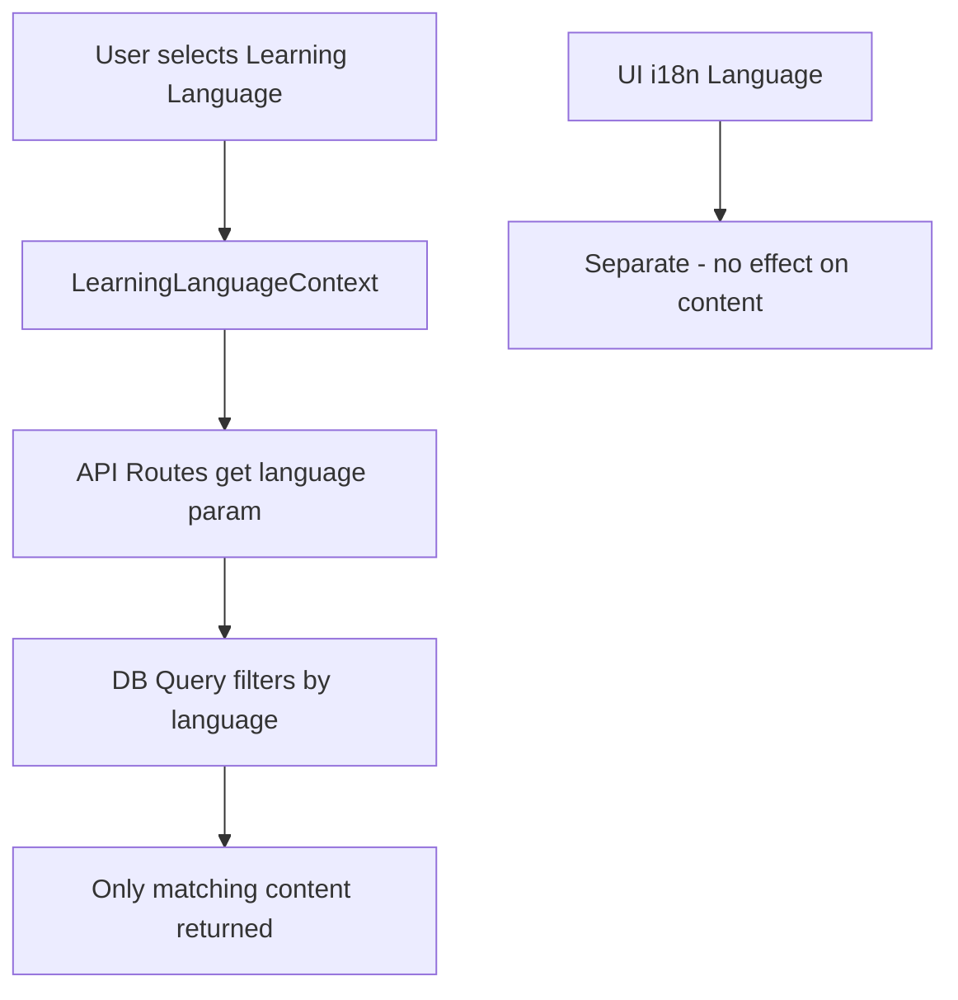

# Multi-Language Content Filter Implementation Plan

## Objective

Allow users to select which **learning language** content to study (en, pt, es, fr). When a user selects "English" as learning language, only English chunks/grammar/vocabulary should appear in study pages, browse, review, etc.

This is SEPARATE from the i18n UI language selector which controls UI translations.

---

## Two Language Concepts

1. **UI Language (i18n)** - Already implemented in [`src/components/LanguageSelector.tsx`](src/components/LanguageSelector.tsx:1)
   - Controls: button labels, navigation, messages, translations
   - Values: en, pt, es, fr

2. **Learning Language (Content Tenant)** - NEW feature
   - Controls: which chunks/vocabulary/grammar to show
   - Values: en, pt, es, fr
   - Users learning French would select `learning_language='fr'`

---

## Implementation Overview



---

## Implementation Phases

### Phase 1: Database Schema Changes

#### Step 1.1: Add `language` column to content tables

```sql
ALTER TABLE chunks ADD COLUMN language TEXT DEFAULT 'en';
ALTER TABLE grammar_structures ADD COLUMN language TEXT DEFAULT 'en';
ALTER TABLE vocabulary_words ADD COLUMN language TEXT DEFAULT 'en';
```

#### Step 1.2: Update existing French content

All French content already has `source_file` like `french_chunks_batch*.json`. We need to update them:

```sql
UPDATE chunks SET language = 'fr' WHERE source_file LIKE 'french_%';
UPDATE grammar_structures SET language = 'fr' WHERE source_file LIKE 'french_%';
UPDATE vocabulary_words SET language = 'fr' WHERE source_file LIKE 'french_%';
```

---

### Phase 2: Create Learning Language Context

#### Step 2.1: Create Language Learning Context

Create [`src/lib/contexts/LearningLanguageContext.tsx`](src/lib/contexts/LearningLanguageContext.tsx)

```typescript
'use client';
import { createContext, useContext, useState, useCallback, ReactNode } from 'react';

interface LearningLanguageContextType {
  learningLanguage: string;
  setLearningLanguage: (lang: string) => void;
}

const LearningLanguageContext = createContext<LearningLanguageContextType | null>(null);

export function LearningLanguageProvider({ children }: { children: ReactNode }) {
  const [learningLanguage, setLearningLanguageState] = useState('en');

  const setLearningLanguage = useCallback((lang: string) => {
    setLearningLanguageState(lang);
    if (typeof window !== 'undefined') {
      localStorage.setItem('learning_language', lang);
    }
  }, []);

  return (
    <LearningLanguageContext.Provider value={{ learningLanguage, setLearningLanguage }}>
      {children}
    </LearningLanguageContext.Provider>
  );
}

export const useLearningLanguage = () => {
  const context = useContext(LearningLanguageContext);
  if (!context) throw new Error('useLearningLanguage must be used within provider');
  return context;
};
```

#### Step 2.2: Add provider to app layout

Update [`src/app/layout.tsx`](src/app/layout.tsx) to wrap children with `<LearningLanguageProvider>`

---

### Phase 3: Create Learning Language Selector Component

#### Step 3.1: Create LearningLanguageSelector

Create [`src/components/LearningLanguageSelector.tsx`](src/components/LearningLanguageSelector.tsx)

```typescript
'use client';

import { useLearningLanguage } from '@/lib/contexts/LearningLanguageContext';

const learningLanguages = [
  { code: 'en', name: 'English', flag: '🇺🇸' },
  { code: 'pt', name: 'Português', flag: '🇧🇷' },
  { code: 'es', name: 'Español', flag: '🇪🇸' },
  { code: 'fr', name: 'Français', flag: '🇫🇷' },
];

export function LearningLanguageSelector() {
  const { learningLanguage, setLearningLanguage } = useLearningLanguage();

  return (
    <select
      value={learningLanguage}
      onChange={(e) => setLearningLanguage(e.target.value)}
      className="px-3 py-2 border rounded-md bg-background text-sm"
    >
      {learningLanguages.map((lang) => (
        <option key={lang.code} value={lang.code}>
          {lang.flag} {lang.name}
        </option>
      ))}
    </select>
  );
}
```

---

### Phase 4: Update Database Functions

#### Step 4.1: Add language parameter to existing functions

Update functions in [`src/lib/db/sqlite.ts`](src/lib/db/sqlite.ts) to accept optional `language` parameter:

```typescript
// Modified signature examples
export function getChunks(limit = 20, offset = 0, language?: string): Chunk[] {
  if (language) {
    return db.prepare(`SELECT * FROM chunks WHERE language = ? LIMIT ?`).all(language, limit);
  }
  return db.prepare(`SELECT * FROM chunks LIMIT ?`).all(limit);
}

export function getChunksByCategory(categoryId: number, limit = 20, offset = 0, language?: string): Chunk[] { ... }
export function searchChunks(query: string, limit = 20, offset = 0, language?: string): Chunk[] { ... }
export function getGrammarStructures(limit = 20, offset = 0, language?: string): GrammarStructure[] { ... }
export function getDueChunks(userId: number, limit = 20, language?: string): Chunk[] { ... }
```

#### Step 4.2: Functions to update:

- `getChunks()`
- `getChunksByCategory()`
- `getChunksByLevel()`
- `getChunksByPattern()`
- `getChunksWithCollocates()`
- `getChunksByCategoryType()`
- `getChunksByPriority()`
- `getSearchChunks()`
- `getDueChunks()`
- `getRandomChunks()`
- `getGrammarStructures()`
- `getGrammarStructuresByCategory()`
- `searchGrammarStructures()`
- `getRandomGrammarStructures()`
- Vocabulary functions

---

### Phase 5: Update API Routes

#### Step 5.1: Routes to modify

Add `language` query parameter to all content-fetching routes:

- [`src/app/api/chunks/browse/route.ts`](src/app/api/chunks/browse/route.ts) - GET ?language=en
- [`src/app/api/chunks/random/route.ts`](src/app/api/chunks/random/route.ts) - GET ?language=en
- [`src/app/api/chunks/by-ids/route.ts`](src/app/api/chunks/by-ids/route.ts) - GET ?language=en
- [`src/app/api/grammar/structures/route.ts`](src/app/api/grammar/structures/route.ts) - GET ?language=en
- [`src/app/api/vocabulary/route.ts`](src/app/api/vocabulary/route.ts) - GET ?language=en
- [`src/app/api/quick/due/route.ts`](src/app/api/quick/due/route.ts) - GET ?language=en
- [`src/app/api/review/due/route.ts`](src/app/api/review/due/route.ts) - GET ?language=en
- [`src/app/api/feynman/chunks/route.ts`](src/app/api/feynman/chunks/route.ts) - GET ?language=en

#### Step 5.2: Pass language from client

Client components should read `learningLanguage` from context and pass as query param.

---

### Phase 6: Update Pages

#### Step 6.1: Pages to update (server-side data fetching)

These pages use server-side data fetching - need to pass language from URL or cookies:

- [`src/app/browse/page.tsx`](src/app/browse/page.tsx) - Accept ?language=en URL param
- [`src/app/chunk/[id]/page.tsx`](src/app/chunk/[id]/page.tsx) - Validate language matches chunk
- [`src/app/grammar/page.tsx`](src/app/grammar/page.tsx) - Accept ?language=en URL param
- [`src/app/page.tsx`](src/app/page.tsx) - Dashboard shows language-specific stats

#### Step 6.2: Components using client-side API calls

These already use API routes - just need to pass language param:

- [`src/app/study/random/page.tsx`](src/app/study/random/page.tsx)
- [`src/app/study/review/page.tsx`](src/app/study/review/page.tsx)
- [`src/app/study/learn/page.tsx`](src/app/study/learn/page.tsx)
- [`src/app/study/quick/page.tsx`](src/app/study/quick/page.tsx)
- [`src/app/study/grammar/page.tsx`](src/app/study/grammar/page.tsx)

---

### Phase 7: UI Updates

#### Step 7.1: Add LearningLanguageSelector to dashboard/sidebar

Place a prominent learning language selector in:

- Dashboard (home page)
- Sidebar navigation
- Settings page

#### Step 7.2: Show current language prominently

The learning language should be clearly displayed so users know which language's content they're studying.

---

## File Changes Summary

| File                                                                                           | Action                         |
| ---------------------------------------------------------------------------------------------- | ------------------------------ |
| [`src/lib/contexts/LearningLanguageContext.tsx`](src/lib/contexts/LearningLanguageContext.tsx) | Create                         |
| [`src/lib/db/sqlite.ts`](src/lib/db/sqlite.ts)                                                 | Modify - add language param    |
| [`src/components/LearningLanguageSelector.tsx`](src/components/LearningLanguageSelector.tsx)   | Create                         |
| [`src/app/layout.tsx`](src/app/layout.tsx)                                                     | Modify - add provider          |
| [`src/app/api/*/route.ts`](src/app/api)                                                        | Modify - accept language param |
| [`src/app/browse/page.tsx`](src/app/browse/page.tsx)                                           | Modify - filter by language    |
| [`src/app/grammar/page.tsx`](src/app/grammar/page.tsx)                                         | Modify - filter by language    |
| [`src/components/layout/Sidebar.tsx`](src/components/layout/Sidebar.tsx)                       | Modify - add selector          |
| [`src/components/dashboard/DashboardClient.tsx`](src/components/dashboard/DashboardClient.tsx) | Modify - add selector          |

---

## Implementation Order

1. **Database schema** - Add language column
2. **Update French content** - Tag existing French imports with `language='fr'`
3. **Tag English content** - Tag existing content with `language='en'`
4. **LearningLanguageContext** - Create context provider
5. **DB functions** - Add language parameter to all queries
6. **API routes** - Accept language param
7. **LearningLanguageSelector** - Create component
8. **Layout** - Add provider
9. **Dashboard/Sidebar** - Add selector
10. **Pages** - Filter by language

---

## Key Points

1. **Separate from i18n**: The learning language is completely separate from UI language. User might have English UI but learn French vocabulary.

2. **localStorage persistence**: Learning language preference should persist in localStorage.

3. **Backward compatible**: If no language specified, show all content (or default to 'en').

4. **URL-based navigation**: Browse and Grammar pages should accept language in URL for bookmarking: `/browse?language=fr`
