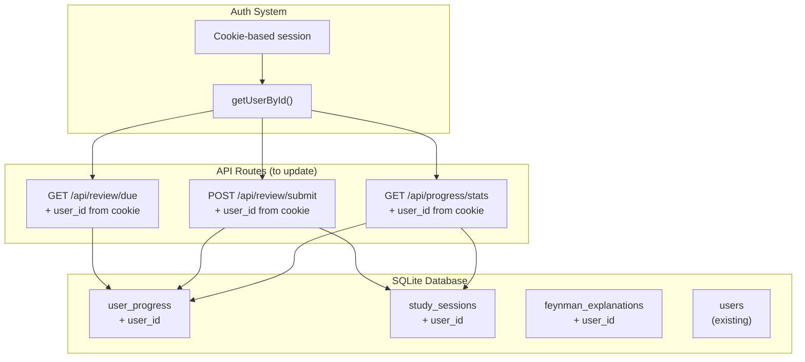

# Plan: Multi-User Progress Support for /progress

## Context

Currently `/progress` shows stats that are **global** (same for all users) because:

- `user_progress` table has no `user_id` column
- `study_sessions` table has no `user_id` column
- `feynman_explanations` table has no `user_id` column

The app already has user authentication via cookies. The goal is to make progress per-user.

## Architecture



## Database Changes

### Migration Script

Add `user_id` column to existing tables and create migration function.

```sql
-- Migration: Add user_id to progress tables
ALTER TABLE user_progress ADD COLUMN user_id INTEGER NOT NULL DEFAULT 1;
ALTER TABLE study_sessions ADD COLUMN user_id INTEGER NOT NULL DEFAULT 1;
ALTER TABLE feynman_explanations ADD COLUMN user_id INTEGER NOT NULL DEFAULT 1;

-- Add foreign keys
-- Note: SQLite doesn't enforce FKs by default, but we add for documentation
```

### Table Schema Changes

#### user_progress

| Column      | Type             | Description                   |
| ----------- | ---------------- | ----------------------------- |
| user_id     | INTEGER NOT NULL | FK to users.id (NEW)          |
| chunk_id    | INTEGER NOT NULL | FK to chunks.id               |
| repetitions | INTEGER          | Consecutive correct responses |
| ...         | ...              | ... (existing fields)         |

**Unique constraint**: `(user_id, chunk_id)` instead of just `chunk_id`

#### study_sessions

| Column  | Type             | Description              |
| ------- | ---------------- | ------------------------ |
| user_id | INTEGER NOT NULL | FK to users.id (NEW)     |
| date    | TEXT NOT NULL    | Date string (YYYY-MM-DD) |
| ...     | ...              | ... (existing fields)    |

**Unique constraint**: `(user_id, date)` instead of just `date`

#### feynman_explanations

| Column   | Type             | Description           |
| -------- | ---------------- | --------------------- |
| user_id  | INTEGER NOT NULL | FK to users.id (NEW)  |
| chunk_id | INTEGER NOT NULL | FK to chunks.id       |
| ...      | ...              | ... (existing fields) |

## Implementation Steps

### 1. Database Migration

- [ ] Create migration function `migrateAddUserIdToProgressTables()`
- [ ] Add user_id columns with default value for existing data
- [ ] Update unique constraints
- [ ] Update foreign key references

### 2. Update SQLite Functions (src/lib/db/sqlite.ts)

- [ ] Modify `getDueChunks(userId, limit)` - add userId param
- [ ] Modify `getChunkProgress(userId, chunkId)` - add userId param
- [ ] Modify `getDueChunksCount(userId)` - add userId param
- [ ] Modify `updateChunkProgress(userId, chunkId, ...)` - add userId param
- [ ] Modify `getMasteredCount(userId)` - add userId param
- [ ] Modify `getMasteredCountByCategory(userId, categoryId)` - add userId param
- [ ] Modify `getCurrentStreak(userId)` - add userId param
- [ ] Modify `recordStudySession(userId, ...)` - add userId param
- [ ] Modify `getProgressStats(userId)` - add userId param
- [ ] Modify `getStartedChunksCount(userId)` - add userId param
- [ ] Modify `isChunkMastered(userId, chunkId)` - add userId param
- [ ] Modify `getMasteredChunks(userId, ...)` - add userId param
- [ ] Modify `getMasteredChunksCount(userId)` - add userId param
- [ ] Modify `saveFeynmanExplanation(userId, ...)` - add userId param
- [ ] Modify `getFeynmanExplanationsForChunk(userId, chunkId)` - add userId param
- [ ] Modify `getFeynmanChunksForStudy(userId, ...)` - add userId param
- [ ] Modify `startChunkProgress(userId, chunkIds)` - add userId param

### 3. Update API Routes

- [ ] `src/app/api/review/due/route.ts` - Extract user from cookie, pass to functions
- [ ] `src/app/api/review/submit/route.ts` - Extract user from cookie, pass to functions
- [ ] `src/app/api/progress/stats/route.ts` - Extract user from cookie, pass to functions
- [ ] `src/app/api/feynman/submit/route.ts` - Extract user from cookie, pass to functions
- [ ] `src/app/api/feynman/chunks/route.ts` - Extract user from cookie, pass to functions

### 4. Helper Function

- [ ] Create `getUserIdFromCookie()` helper to extract user_id from session cookie
- [ ] Add to a utility file or inline in routes

## Files to Modify

| File                                  | Action | Description                           |
| ------------------------------------- | ------ | ------------------------------------- |
| `src/lib/db/sqlite.ts`                | Modify | Add user_id to all progress functions |
| `src/app/api/review/due/route.ts`     | Modify | Pass userId to getDueChunks           |
| `src/app/api/review/submit/route.ts`  | Modify | Pass userId to progress functions     |
| `src/app/api/progress/stats/route.ts` | Modify | Pass userId to getProgressStats       |
| `src/app/api/feynman/submit/route.ts` | Modify | Pass userId to feynman functions      |
| `src/app/api/feynman/chunks/route.ts` | Modify | Pass userId to feynman functions      |

## Breaking Changes

- All progress functions now require `userId` as first parameter
- Existing data in `user_progress`, `study_sessions`, `feynman_explanations` will be assigned to `user_id = 1` (default/legacy)
- Pages don't need changes - they already fetch from API which extracts user from cookie

## Test Plan

1. Register/login as user A → Review some chunks → Check /progress
2. Register/login as user B → Check /progress → Should see empty progress
3. User A's progress should be independent of User B's
4. Study sessions should be tracked per-user (streak calculation)
5. Feynman explanations should be per-user
