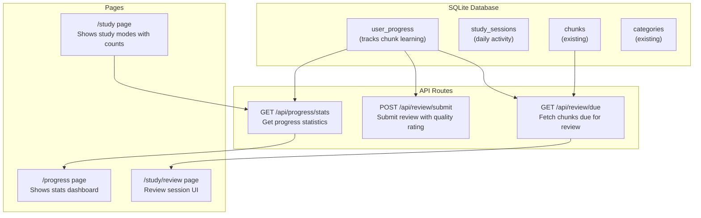

# Plan: Make /progress and /study Functional

## Context

Currently `/progress` shows hardcoded "0" for Mastered and Day Streak, and `/study/review` uses empty mock data. The app needs user progress tracking with spaced repetition using the existing SM-2 algorithm.

## Architecture



## Database Schema

### New Tables

#### user_progress

Tracks individual chunk learning state with SM-2 parameters.

| Column        | Type                | Description                               |
| ------------- | ------------------- | ----------------------------------------- |
| id            | INTEGER PRIMARY KEY | Auto-increment ID                         |
| chunk_id      | INTEGER             | FK to chunks.id                           |
| repetitions   | INTEGER             | Consecutive correct responses (default 0) |
| ease_factor   | REAL                | Difficulty multiplier (default 2.5)       |
| interval      | INTEGER             | Days until next review (default 0)        |
| next_review   | INTEGER             | Unix timestamp for next review date       |
| last_reviewed | INTEGER             | Unix timestamp of last review             |
| created_at    | INTEGER             | Creation timestamp                        |
| updated_at    | INTEGER             | Last update timestamp                     |

#### study_sessions

Tracks daily study activity for streak calculation.

| Column          | Type                | Description               |
| --------------- | ------------------- | ------------------------- |
| id              | INTEGER PRIMARY KEY | Auto-increment ID         |
| date            | TEXT                | Date string (YYYY-MM-DD)  |
| chunks_reviewed | INTEGER             | Number of chunks reviewed |
| chunks_mastered | INTEGER             | Chunks reached mastery    |
| created_at      | INTEGER             | Creation timestamp        |

## API Endpoints

### GET /api/review/due

Returns chunks due for review today.

**Response:**

```json
{
  "chunks": [
    {
      "id": "1",
      "chunk": "as far as I know",
      "meaning": "in my opinion",
      "examples": [...],
      "category": { "id": "1", "name": "Conversation", "level": "foundation" }
    }
  ],
  "count": 5
}
```

### POST /api/review/submit

Submits a review with quality rating, updates SM-2 parameters.

**Request:**

```json
{
  "chunkId": 1,
  "quality": 4
}
```

**Response:**

```json
{
  "success": true,
  "nextReview": "2026-05-04",
  "interval": 7,
  "isMastered": false
}
```

### GET /api/progress/stats

Returns dashboard statistics.

**Response:**

```json
{
  "totalChunks": 1500,
  "categories": 12,
  "mastered": 45,
  "dueToday": 8,
  "streak": 7,
  "categoryProgress": [...]
}
```

## Implementation Steps

1. **Add new table creation in sqlite.ts**
   - Add `initUserProgressTables()` function
   - Creates `user_progress` and `study_sessions` tables

2. **Add new query functions in sqlite.ts**
   - `getDueChunks(limit)` - Get chunks where next_review <= today
   - `getChunkProgress(chunkId)` - Get progress for a chunk
   - `updateChunkProgress(chunkId, sm2Result)` - Update after review
   - `getProgressStats()` - Get all stats for dashboard
   - `recordStudySession(chunksReviewed)` - Record daily activity
   - `getCurrentStreak()` - Calculate streak from session history

3. **Create API routes**
   - `src/app/api/review/due/route.ts` - GET due chunks
   - `src/app/api/review/submit/route.ts` - POST review result
   - `src/app/api/progress/stats/route.ts` - GET stats

4. **Update pages**
   - `/progress` - Use `getProgressStats()` for real data
   - `/study` - Show actual due count from API
   - `/study/review` - Fetch due chunks and handle review submission

## Files to Modify/Create

| File                                  | Action | Description                              |
| ------------------------------------- | ------ | ---------------------------------------- |
| `src/lib/db/sqlite.ts`                | Modify | Add progress tracking tables and queries |
| `src/app/api/review/due/route.ts`     | Create | GET chunks due for review                |
| `src/app/api/review/submit/route.ts`  | Create | POST review quality                      |
| `src/app/api/progress/stats/route.ts` | Create | GET progress statistics                  |
| `src/app/progress/page.tsx`           | Modify | Use real stats from API                  |
| `src/app/study/page.tsx`              | Modify | Show actual due count                    |
| `src/app/study/review/page.tsx`       | Modify | Fetch chunks from API                    |

## Test Plan

1. Start review session → Should show chunks due today
2. Submit review with quality rating → Should update SM-2 params
3. Check /progress → Should show updated streak and mastered count
4. After interval passes → Same chunk should appear again for review

## Priority

- Core: Review flow (due chunks → submit → progress update)
- Secondary: Stats tracking (streak, mastered count)
- Later: Feynman mode, Quick Practice (depend on basic flow working)
