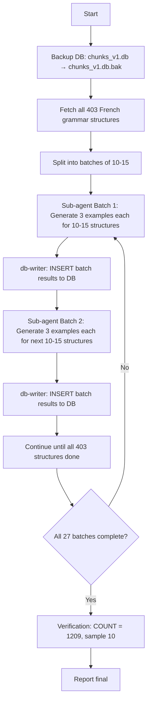

# Plan: Seed French Grammar Examples (Batched Sub-Agent Orchestration)

## Context Summary

| Item                 | Details                                        |
| -------------------- | ---------------------------------------------- |
| Database             | `./chunks_v1.db` (SQLite, better-sqlite3)      |
| Target table         | `examples`                                     |
| Filter               | `item_type='grammar_structure'`                |
| French structures    | **403** (language='fr'), each needs 3 examples |
| Expected inserts     | **1209** (403 × 3)                             |
| Sub-agent batch size | **10-15 structures** per agent                 |

## Schema Findings

### `examples` table

| Column          | Type    | NOT NULL | Default                |
| --------------- | ------- | -------- | ---------------------- |
| `id`            | INTEGER | No       | auto                   |
| `item_type`     | TEXT    | **Yes**  | -                      |
| `item_id`       | INTEGER | **Yes**  | -                      |
| `example_index` | INTEGER | **Yes**  | `1`                    |
| `text_en`       | TEXT    | **Yes**  | -                      |
| `text_target`   | TEXT    | No       | -                      |
| `audio_path`    | TEXT    | No       | -                      |
| `is_canonical`  | INTEGER | **Yes**  | `0`                    |
| `created_at`    | INTEGER | **Yes**  | `strftime('%s','now')` |

**No UNIQUE constraint** on `(item_type, item_id, example_index)`. Idempotency handled by checking existing records before insert.

## Data Polarity

For French structures:

- `text_target` = French example (the illustrative phrase)
- `text_en` = English translation (faithful, idiomatic)

## Batched Sub-Agent Workflow



## Batch Distribution

| Batch | Structure IDs | Count |
| ----- | ------------- | ----- |
| 1     | 346-360       | 15    |
| 2     | 361-375       | 15    |
| ...   | ...           | ...   |

**Total batches required:** ~27 (at 15 per batch) or ~40 (at 10 per batch)

## Example Generation Rules

- No lexical repetition among the 3 examples for same structure
- Progressive complexity (simple → complex)
- Isolated sentences (no external context)
- Correct punctuation, no markdown
- CEFR level coherent with structure complexity

## Example Object Schema

```typescript
interface GrammarExample {
  item_type: 'grammar_structure';
  item_id: number;
  example_index: 0 | 1 | 2;
  text_en: string; // French example
  text_target: string; // English translation
  is_canonical: 0;
}
```

## Verification Queries

```sql
-- Total count
SELECT COUNT(*) FROM examples
WHERE item_type='grammar_structure'
AND item_id IN (SELECT id FROM grammar_structures WHERE language='fr');
-- Expected: 1209

-- NULL check
SELECT COUNT(*) FROM examples
WHERE item_type='grammar_structure'
AND item_id IN (SELECT id FROM grammar_structures WHERE language='fr')
AND (text_en IS NULL OR text_en = '' OR text_target IS NULL OR text_target = '');
-- Expected: 0
```

## Restrictions

- No string interpolation in SQL — prepared statements only
- Batch in single transaction, rollback on any failure
- Run twice = no duplicates (idempotent)
- Backup before INSERT
