# Study Modes Language Filter Fix Plan

## Problem Summary

When a user selects a learning language (e.g., French), the study modes should filter content by that language. Currently, **Grammar Study** and **Feynman Mode** do not filter by language - they return content from all languages.

## Current Analysis

### Study Modes with Language Filtering ✅

| Mode            | Page               | Filtering                                                                     |
| --------------- | ------------------ | ----------------------------------------------------------------------------- |
| Quick Practice  | `/study/quick`     | ✅ Uses `learningLanguage` and passes to `/api/quick/due?language=...`        |
| Learn New       | `/study/learn`     | ✅ Uses `learningLanguage` and passes to `/api/learn/categories?language=...` |
| Review          | `/study/review`    | ✅ Uses `learningLanguage` and passes to `/api/review/due?language=...`       |
| Random Chunks   | `/study/random`    | ✅ Uses `learningLanguage` and passes to `/api/chunks/random?language=...`    |
| Vocabulary Game | `/vocabulary-game` | ✅ Uses `learningLanguage` and passes to `/api/vocabulary?language=...`       |

### Study Modes WITHOUT Language Filtering ❌

| Mode                   | Page                                       | Issue                                                                               |
| ---------------------- | ------------------------------------------ | ----------------------------------------------------------------------------------- |
| Grammar Study          | `/study/grammar`                           | Does NOT use `learningLanguage`, calls `/api/grammar/study` with no language param  |
| Feynman Mode           | `/study/feynman`                           | Does NOT use `learningLanguage`, calls `/api/feynman/chunks` with no language param |
| Word Game (study page) | `/study` - Card link to `/vocabulary-game` | ✅ Works (uses context)                                                             |
| Progress Stats         | `/study` - stats display                   | ❌ Shows total chunks across ALL languages                                          |

## Root Cause Analysis

### 1. Grammar Study (`/study/grammar/page.tsx`)

- Line 194: `fetch('/api/grammar/study?limit=10')` - no language parameter
- Does not import or use `useLearningLanguage()` hook

### 2. Feynman Mode (`/study/feynman/page.tsx`)

- Line 27: `fetch('/api/feynman/chunks?limit=10')` - no language parameter
- Does not import or use `useLearningLanguage()` hook

### 3. DB Functions (`sqlite.ts`)

- [`getRandomGrammarStructures()`](src/lib/db/sqlite.ts:472) - accepts optional `language` param but API doesn't pass it
- [`getSmartFeynmanChunks()`](src/lib/db/sqlite.ts:1315) - does NOT accept language param at all, needs modification

### 4. API Routes

- [`/api/grammar/study/route.ts`](src/app/api/grammar/study/route.ts:22) - doesn't read language from query and pass to DB
- [`/api/feynman/chunks/route.ts`](src/app/api/feynman/chunks/route.ts:15) - doesn't read language from query and pass to DB

## Fix Plan

### Step 1: Update `getSmartFeynmanChunks` in sqlite.ts

Add `language` parameter to filter chunks by content language.

```typescript
export function getSmartFeynmanChunks(
  userId: number,
  limit = 10,
  language?: string,
): SmartFeynmanChunk[];
```

### Step 2: Update `/api/grammar/study/route.ts`

- Read `language` query param
- Pass to `getRandomGrammarStructures(categoryId, limit, language)`

### Step 3: Update `/api/feynman/chunks/route.ts`

- Read `language` query param
- Pass to `getSmartFeynmanChunks(userId, limit, language)`

### Step 4: Update `/study/grammar/page.tsx`

- Import `useLearningLanguage` from context
- Add `learningLanguage` state from hook
- Pass `language=${learningLanguage}` in fetch URL

### Step 5: Update `/study/feynman/page.tsx`

- Import `useLearningLanguage` from context
- Add `learningLanguage` state from hook
- Pass `language=${learningLanguage}` in fetch URL

## Mermaid Diagram - Current vs Fixed Flow

```mermaid
graph TD
    subgraph "CURRENT (BROKEN)"
        A1["User selects French"] --> B1["/study/grammar"]
        A1 --> B2["/study/feynman"]
        B1 --> C1["fetch /api/grammar/study?limit=10"]
        B2 --> C2["fetch /api/feynman/chunks?limit=10"]
        C1 --> D1["getRandomGrammarStructures()"]
        C2 --> D2["getSmartFeynmanChunks()"]
        D1 --> E1["Returns ALL languages"]
        D2 --> E2["Returns ALL languages"]
    end

    subgraph "FIXED (WORKING)"
        A2["User selects French"] --> F1["/study/grammar"]
        A2 --> F2["/study/feynman"]
        F1 --> G1["useLearningLanguage() = 'fr'"]
        F2 --> G2["useLearningLanguage() = 'fr'"]
        G1 --> H1["fetch /api/grammar/study?limit=10&language=fr"]
        G2 --> H2["fetch /api/feynman/chunks?limit=10&language=fr"]
        H1 --> I1["getRandomGrammarStructures(..., 'fr')"]
        H2 --> I2["getSmartFeynmanChunks(..., 'fr')"]
        I1 --> J1["Returns ONLY French"]
        I2 --> J2["Returns ONLY French"]
    end
```



## Files to Modify

1. `src/lib/db/sqlite.ts` - Add language param to `getSmartFeynmanChunks`
2. `src/app/api/grammar/study/route.ts` - Pass language to DB function
3. `src/app/api/feynman/chunks/route.ts` - Pass language to DB function
4. `src/app/study/grammar/page.tsx` - Use learningLanguage context
5. `src/app/study/feynman/page.tsx` - Use learningLanguage context
