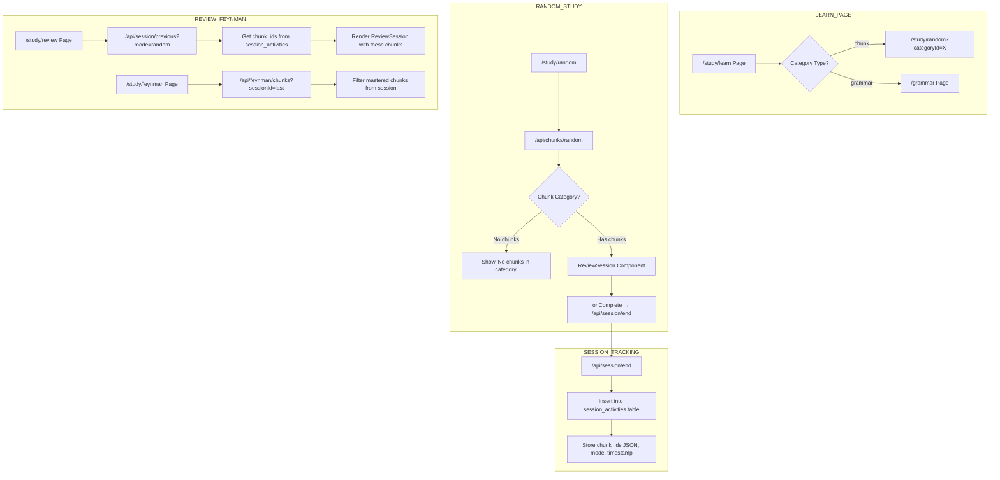

# Study Progress Integration Plan

## Problem Analysis

### Root Cause

When user clicks on a grammar category in `/study/learn` page:

1. Link is `/study/random?categoryId=X`
2. `/api/chunks/random` fetches from `chunks` table only
3. Grammar categories have NO chunks - they have `grammar_structures` instead
4. Result: empty chunks array → "session complete" with 0 items

### User Experience Bug

User clicks "Past Tenses" → sees "session complete" immediately → thinks they've finished everything

---

## Solution Architecture

### Mermaid Flow Diagram



---

## Implementation Tasks

### Task 1: Fix Category Routing in Learn Page

**File:** `src/app/study/learn/page.tsx`

Change the links to properly route grammar categories:

- If `category.type === 'grammar' or category.type === 'foundation'` → link to `/grammar?category={category.id}`
- If `category.type === 'chunk'` → link to `/study/random?categoryId={category.id}`

**Code change:**

```typescript
// In category card action buttons:
<Link href={category.type === 'chunk'
    ? `/study/random?categoryId=${category.id}&categoryName=${encodeURIComponent(category.name)}`
    : `/grammar?category=${category.id}`}
>
```

---

### Task 2: Add Session Activities Table

**File:** `src/lib/db/sqlite.ts`

Create new table to track studied chunk IDs per session:

```sql
CREATE TABLE session_activities (
    id INTEGER PRIMARY KEY AUTOINCREMENT,
    user_id INTEGER NOT NULL,
    session_date TEXT NOT NULL,
    mode TEXT NOT NULL, -- 'random', 'review', 'feynman'
    chunk_ids TEXT NOT NULL, -- JSON array of chunk IDs studied
    grammar_ids TEXT, -- JSON array of grammar structure IDs (future)
    created_at INTEGER DEFAULT (strftime('%s', 'now')),
    UNIQUE(user_id, session_date, mode)
);
```

Add functions:

- `recordSessionActivity(userId, mode, chunkIds)` - stores session chunk IDs
- `getPreviousSessionChunkIds(userId, mode)` - retrieves last session's chunk IDs
- `getRecentSessions(userId, limit)` - gets recent sessions for review/feynman

---

### Task 3: Update Session End API

**File:** `src/app/api/session/end/route.ts`

Modify to:

1. Accept optional `chunkIds` array in request body
2. Store chunk IDs in `session_activities` table
3. Return session ID for reference

**Request body change:**

```typescript
{
  mode: string,
  chunksReviewed: number,
  chunksMastered: number,
  chunkIds?: number[]  // NEW: track specific chunks studied
}
```

---

### Task 4: Create Session Activities API

**File:** `src/app/api/session/activities/route.ts`

Endpoints:

- `GET /api/session/activities?mode=random` - Get chunk IDs from last random session
- `GET /api/session/activities?mode=review&limit=20` - Get due chunks from session history

---

### Task 5: Update Random Study Page

**File:** `src/app/study/random/page.tsx`

- Track all chunk IDs shown during session
- Pass `chunkIds` array to `/api/session/end` on completion

---

### Task 6: Create Review Mode from Session

**File:** `src/app/study/review/page.tsx`

Option to practice chunks from previous session:

1. Fetch previous session chunk IDs via `/api/session/activities?mode=random`
2. Get full chunk data for those IDs
3. Present as "Practice again" or "Continue where you left off"

---

### Task 7: Update Feynman to Use Session Chunks

**File:** `src/app/study/feynman/page.tsx`

Feynman mode already uses mastered chunks. Add session context:

1. On session start, check if there are chunks from a recent session to focus on
2. Or just continue with current mastered chunks logic (already works)

---

## Database Schema Changes

```sql
-- New table for tracking session activities
CREATE TABLE session_activities (
    id INTEGER PRIMARY KEY AUTOINCREMENT,
    user_id INTEGER NOT NULL,
    session_date TEXT NOT NULL,
    mode TEXT NOT NULL,
    chunk_ids TEXT NOT NULL,
    grammar_ids TEXT,
    created_at INTEGER DEFAULT (strftime('%s', 'now')),
    UNIQUE(user_id, session_date, mode)
);

CREATE INDEX idx_session_activities_user_mode ON session_activities(user_id, mode);
```

---

## API Changes Summary

### Modified APIs

1. `POST /api/session/end` - now accepts and stores `chunkIds[]`
2. `GET /api/chunks/random` - returns empty with proper message for grammar categories

### New APIs

1. `GET /api/session/activities?mode=random` - get chunk IDs from last random session
2. `GET /api/chunks/by-ids?ids=1,2,3` - get full chunk data for specific IDs
3. `GET /api/session/review-due` - get due chunks filtered by previous session

---

## Files to Modify

| File                                      | Changes                                    |
| ----------------------------------------- | ------------------------------------------ |
| `src/app/study/learn/page.tsx`            | Fix category routing                       |
| `src/lib/db/sqlite.ts`                    | Add session_activities table and functions |
| `src/app/api/session/end/route.ts`        | Store chunk IDs                            |
| `src/app/api/chunks/random/route.ts`      | Handle grammar categories properly         |
| `src/app/study/random/page.tsx`           | Track and send chunk IDs                   |
| `src/app/study/review/page.tsx`           | Add "continue session" option              |
| `src/app/api/session/activities/route.ts` | NEW - get session chunk IDs                |
| `src/app/api/chunks/by-ids/route.ts`      | NEW - get chunks by IDs                    |

---

## Testing Scenarios

1. **Grammar Category Click**
   - Click grammar category in `/study/learn`
   - Should navigate to `/grammar?category=X`
   - NOT to `/study/random`

2. **Chunk Category Click**
   - Click chunk category in `/study/learn`
   - Should navigate to `/study/random?categoryId=X`
   - Shows ReviewSession with chunks

3. **Session Completion**
   - Complete random study session
   - Chunk IDs stored in session_activities
   - Can be retrieved for review/feynman

4. **Review from Previous Session**
   - After random session, can review same chunks
   - Feynman mode uses mastered chunks from sessions
