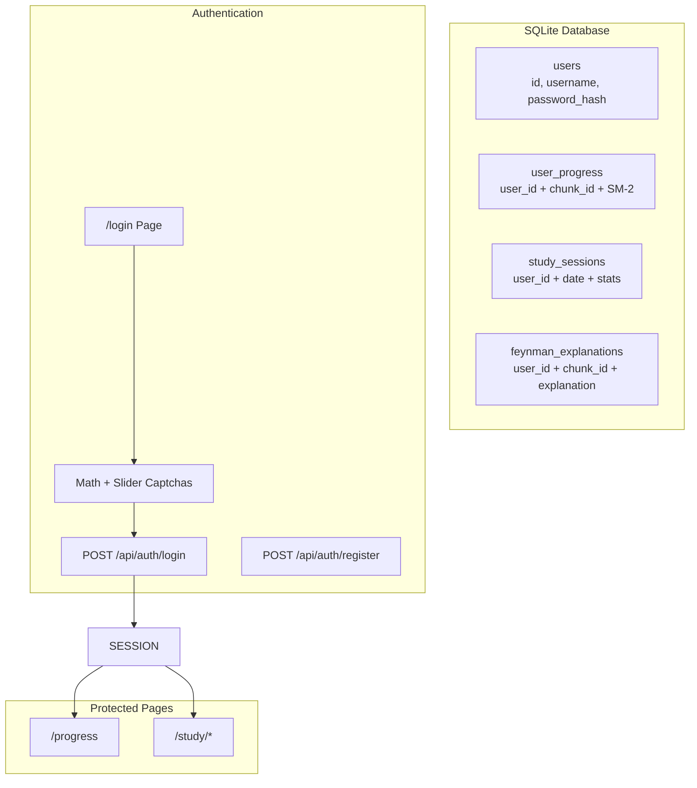

# Plan: User Authentication System with CAPTCHAs

## Context

Currently, all study progress is stored without user identification - everyone shares the same progress. The user wants a simple login system where each user has their own independent study progress, protected by two simple CAPTCHAs.

## CAPTCHAs to Implement

### 1. Math CAPTCHA

- Generates random math problem (e.g., "What is 7 + 5?")
- Numbers between 1-20, operations: +, -, ×
- User must type correct answer
- Regenerates on failure

### 2. Slider CAPTCHA

- "Slide to unlock" mechanism
- Visual track with a handle
- Must slide handle to end of track
- Prevents automated bots

## Architecture



## Database Schema

### New Table: users

```sql
CREATE TABLE users (
  id INTEGER PRIMARY KEY AUTOINCREMENT,
  username TEXT UNIQUE NOT NULL,
  password_hash TEXT NOT NULL,
  created_at INTEGER DEFAULT (strftime('%s', 'now'))
);
```

### Modified Tables (add user_id)

**user_progress, study_sessions, feynman_explanations**

- Add `user_id INTEGER DEFAULT 1`

## Implementation Steps

### Step 1: Add User Functions to SQLite

- `createUser(username, passwordHash)`
- `getUserByUsername(username)`
- `getUserById(id)`
- `verifyPassword(password, hash)`

### Step 2: Create CAPTCHA Components

#### MathCaptcha Component

```tsx
interface MathCaptchaProps {
  onSuccess: () => void;
  onFail: () => void;
}
// Generates random math problem
// Input field for answer
// Validates and regenerates on fail
```

#### SliderCaptcha Component

```tsx
interface SliderCaptchaProps {
  onSuccess: () => void;
}
// Track with handle
// Draggable handle
// Success when slid to end
```

### Step 3: Create Auth API Routes

- `POST /api/auth/register`
- `POST /api/auth/login`
- `POST /api/auth/logout`
- `GET /api/auth/me`

### Step 4: Create Login/Register Pages

- Both pages show Math CAPTCHA first
- After math pass, show Slider CAPTCHA
- Then proceed to form submission

### Step 5: Auth Context + Protect Routes

- `AuthContext` for user state
- Middleware to protect pages
- Redirect to login if not authenticated

## CAPTCHA Implementation Details

### Math CAPTCHA Logic

```typescript
// Generate: num1 (1-20) operator (+, -, ×) num2 (1-20)
// For ×: num2 limited to 1-10
// Store correct answer in session or hidden field
// Validate on submit
```

### Slider CAPTCHA Logic

```typescript
// Track: 200px wide, 40px tall
// Handle: 40px circle
// Drag: 0 to 100%
// Success: dragged > 90%
// Visual: gradient track, handle follows mouse/touch
```

## Files to Create/Modify

### New Files

| File                                        | Description              |
| ------------------------------------------- | ------------------------ |
| `src/app/login/page.tsx`                    | Login page               |
| `src/app/register/page.tsx`                 | Register page            |
| `src/app/api/auth/register/route.ts`        | Register API             |
| `src/app/api/auth/login/route.ts`           | Login API                |
| `src/app/api/auth/logout/route.ts`          | Logout API               |
| `src/app/api/auth/me/route.ts`              | Get current user         |
| `src/components/auth/MathCaptcha.tsx`       | Math CAPTCHA component   |
| `src/components/auth/SliderCaptcha.tsx`     | Slider CAPTCHA component |
| `src/components/providers/AuthProvider.tsx` | Auth context             |

### Modified Files

| File                   | Changes                         |
| ---------------------- | ------------------------------- |
| `src/lib/db/sqlite.ts` | Add user functions, add user_id |
| `src/app/layout.tsx`   | Add AuthProvider                |
| `src/middleware.ts`    | Protect routes                  |

## Flow

### Registration

1. User enters username/password
2. Math CAPTCHA shown → solve → next
3. Slider CAPTCHA shown → slide → next
4. Submit to /api/auth/register
5. Success → redirect to login

### Login

1. User enters username/password
2. Math CAPTCHA shown → solve → next
3. Slider CAPTCHA shown → slide → next
4. Submit to /api/auth/login
5. Success → set cookie, redirect to dashboard

## Security Considerations

1. **Password Hashing**: bcrypt for passwords
2. **Session Cookie**: HttpOnly, SameSite
3. **CAPTCHA State**: Generated per attempt, validated server-side
4. **Rate Limiting**: Could add (optional)

## Simplicity Decisions

1. No email verification
2. No password reset
3. No OAuth/social login
4. Session stored in cookie (not database)
5. Existing data → user_id=1 (guest)

## Test Plan

1. Register with wrong math answer → rejected
2. Register with incomplete slider → rejected
3. Register with correct CAPTCHAs + valid data → success
4. Login with wrong password → error
5. Login with correct credentials + CAPTCHAs → success
6. Check progress → shows only user's data
7. Logout → redirected to login
